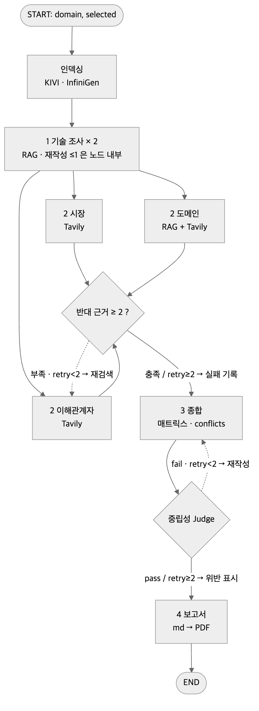

# KV cache 최적화 기술 다관점 평가 — Agentic RAG

본 프로젝트는 KV cache 최적화 기술을 SW(KIVI), HW(InfiniGen) 두 진영에서 하나씩 선정하여,
**스마트폰 온디바이스 LLM** 도메인 안에서 기술 성숙도, 시장, 이해관계자, 도메인 관점으로
비교 평가하는 Agentic RAG이다. 우열을 판정하지 않고, 관점에 따라 평가가 어떻게 엇갈리는지를 드러낸다.

> SKALA 판교 10반 · 박유진 · 황재원 · 민영은 · 심준용
> 설계서: [docs/설계서.md](docs/설계서.md) · 협업 규칙: [CONTRIBUTING.md](CONTRIBUTING.md) · 분담: [docs/ROLES.md](docs/ROLES.md)

## Overview
- Objective : 하나의 도메인(스마트폰 온디바이스 LLM)에서 두 기술을 4가지 관점으로 비교 평가
- Method : Multi-Agent — Branching(fan-out/fan-in) + Loop, 규칙 기반 Dispatcher + Agentic RAG
- Tools : LangGraph, Chroma, BGE-M3, Tavily, LangSmith, RAGAS
- Frame : 판정은 배포 제약(재학습 불필요 · 전용 HW 불필요)으로, 해석은 **Recall · Latency · Memory 3축**으로 — 하나를 얻으면 하나를 내준다(KIVI 는 Recall 을, InfiniGen 은 Latency 를). 온디바이스는 Memory 가 절대 제약이라 "무엇을 포기했고 그 포기가 감당 가능한가"를 본다 (설계서 0.3 · 4.4)

## Selected Technologies
- SW : **KIVI** (ICML 2024) — 사후·무보정 2bit KV 양자화. 재학습 없이 배포된 모델에 즉시 적용, 피크 메모리 2.6× 감소. 정확도 trade-off 가 관점 대조 재료 (설계서 1.3)
- HW : **InfiniGen** (OSDI 2024) — 동적 KV 오프로딩·프리패치. 전용 HW 없이 메모리 계층을 쓰는 유일한 후보, 정확도 무손실 vs 전송·전력 (설계서 1.4)
- 선정 방식 : 조가 기준표(온디바이스 적용 가능성 · 자료 확보 · 성숙도 · 코퍼스 적합성)로 6편 비교 후 선정 — `config/selection.yaml`

## Features
- 논문 2편(33p) 기반 사실 추출 — 페이지 인용 `[p.N]`, 기술별 독립 검색(`tech` 필터)
- 한국어 질의 → 영어 논문 cross-lingual 검색 — **이중 질의 하이브리드**: dense(BGE-M3) 는 한국어 원 질의, BM25 는 영어 번역 질의, RRF 0.5/0.5, k=4
- 관련성 체크 → 질문 재작성 1회 → 실패 시 "논문에 근거 없음" 기록 (재작성 전/후 로그)
- 시장·이해관계자는 Tavily 웹검색, 도메인은 RAG + 웹 (HW 우호 반례 필수 수집)
- 확증 편향 방지 장치 8개 : ① 사전 가설 명시 ② 기술별 독립 호출 ③ 사실 단위 질의 ④ 정확도 임계값 없음 ⑤ 관련성 실패 → "근거 없음" 기록 ⑥ 출처 태그 강제 `[논문]/[웹]/[추론]` — 무태그 문장은 `[추론]` 으로 기록 ⑦ 반대 근거 ≥2 강제(≤2회 재검색) ⑧ 중립성 검증 루프(≤2회) — 설계서 5.5
- 보고서 REFERENCE 는 실제 인용된 `citations` 에서만 자동 생성

## Tech Stack
- Framework : LangGraph 1.x (Python 3.11, uv)
- LLM/Generator : gpt-4.1-mini
- LLM/Judge : gpt-4.1-mini (temperature 0, Generator 와 별도 인스턴스) — 관련성 · Faithfulness · 중립성 · 질문 재작성 · 영어 번역 질의
- Retrieval : Chroma(dense) + BM25(sparse) 이중 질의 하이브리드, RRF 0.5/0.5, k=4, Reranker 없음 — **Hit Rate@4 0.80 · MRR@4 0.52** (20문항, dense 단독 0.55/0.40 → [실측](experiments/sparse_compare/README.md))
- Embedding : `BAAI/bge-m3` (오픈소스, 로컬) — 후보 4개 대조군을 우리 코퍼스·한국어 질의로 실측해 선정 ([실측](experiments/embed_compare/README.md), 설계서 3.5)
- Generation eval : RAGAS **Faithfulness 0.936 · ResponseRelevancy 0.838 · ContextPrecision 0.912** (20문항)
- Web search : Tavily (시장 · 이해관계자 · HW 반례) · Observability : LangSmith `kv-cache-eval`

> 설계서 3.6 의 nano(판단 없는 변환)는 미사용 — 유일한 변환 단계인 번역 질의가 검색 성패를 가르므로(nano 0.75 / mini 0.80) mini 로. Reranker 는 k=4 에서 목표 Hit@4 를 달성해 두지 않음 (설계서 3.4)

## Agents

| 에이전트 | 역할 | RAG | 도구 | 출력 키 |
|---|---|---|---|---|
| Dispatcher | 워커 호출·재호출을 State 규칙으로 결정. LLM 없음 | — | — | `next`, `retry` |
| 기술 조사 | 논문에서 개요·메커니즘·수치·한계·적용조건 추출 (기술별 독립) | O | retriever | `tech_summary` |
| 시장 평가 | 시장 규모·채택·생태계 | X | Tavily | `market_eval` |
| 이해관계자 평가 | 경쟁 진영·개발자·투자 반응, 찬반 각 ≥2 | X | Tavily | `stakeholder_eval` |
| 도메인 평가 | 논문 사실 추출 → 온디바이스 제약으로 판정, HW 반례 웹검색 | O | retriever + Tavily | `domain_eval` |
| 평가 종합 | 관점 × 기술 매트릭스, 일치/상충, TRL, 중립성 검증 | X | — | `synthesis`, `trl_estimate`, `neutrality` |
| 보고서 생성 | 6장 목차 md → PDF, REFERENCE 자동 | X | — | `report_md` |

## Architecture



설계 그림(위)과 `python -m graph.build` 가 그린 컴파일 결과([graph_compiled.png](docs/images/graph_compiled.png))가 같다 — 워커 6개가 전부 `dispatcher` 로 수렴하고, 조건부 엣지가 7갈래(+END)로 나간다.

인덱싱 → ① 기술 조사 → ② 평가 3개 병렬(fan-out, 분리 키) → ③ 종합 + 중립성 Judge → ④ 보고서.
Loop: 관련성 재작성 ≤1(RAG 노드 내부) · 반대 근거 부족 ≤2 · 중립성 반려 ≤2. `llm_calls > 150` 이면 재호출만 중단하고 종합·보고서는 진행 (설계 100 → #29). 워커 예외는 `graph/safe.py` 가 자기 키의 실패 기록으로 바꿔 형제 워커 결과를 지키고 END 까지 간다.

RAG 파이프라인: [전처리](docs/images/pipeline_pre.png) · [검색·관련성](docs/images/pipeline_ret.png) · [생성·사실성](docs/images/pipeline_gen.png)

## Directory Structure

```
├── app.py                 # 실행 스크립트 — 인덱싱 확인 → 그래프 실행 → outputs/
├── graph/                 # state.py(State 스키마) · dispatcher.py(규칙표) · build.py(조립)
├── agents/                # 워커 6개 — run(state) -> dict
├── rag/                   # indexing · retriever · judge · rag_node(ask) · evaluate
├── prompts/               # 에이전트별 프롬프트 .md + rubrics/(4.1~4.5)
├── config/                # domain.yaml(0.3 환경) · selection.yaml(1장 선정)
├── data/                  # papers/(논문 PDF, git 제외) · index/ · cache/
├── experiments/           # 임베딩 실측(embed_compare) · sparse 비교
├── outputs/               # report/(보고서 md·PDF) · retrieval_log.json · citations.json
├── tests/                 # LLM 없이 도는 단위 테스트 (dispatcher 규칙표)
├── scripts/               # fetch_papers.sh
├── docs/                  # 설계서.md · ROLES.md · images/
└── README.md
```

## Usage

```bash
uv sync --extra pdf              # Python 3.11, .venv — md→PDF 는 weasyprint(brew install pango)
cp .env.example .env             # OPENAI_API_KEY · TAVILY_API_KEY · LANGSMITH_API_KEY
bash scripts/fetch_papers.sh     # arXiv 2402.02750, 2406.19707 → data/papers/
uv run python -m rag.indexing    # BGE-M3 임베딩(첫 실행 시 모델 다운로드) → data/index/
uv run python app.py             # 그래프 실행 → outputs/report/report.md (+ .pdf)
#   --skip-index                    인덱싱 건너뜀 / --pdf-name <파일명>  제출용 PDF 이름
#   실패해도 outputs/run.json (visited · llm_calls · retry · error) 과 채워진 State 키의 .json 은 남는다
uv run python -m agents.report   # 보고서 워커만 fixtures 로 단독 실행 (LLM 4회)

uv run python -m rag.evaluate    # Hit Rate@4 · MRR@4 · RAGAS
uv run pytest                    # 단위 테스트
```

## Contributors
- 박유진 : RAG Pipeline (Indexing · Hybrid Retrieval · Relevance/Faithfulness Judge), Embedding 실측·선정, 기술 조사 Agent, Repo 구성
- 심준용 : 기술 선정 기준표·HW 선정 사유, 시장 평가 Agent, 이해관계자 평가 Agent (반대 근거 강제)
- 민영은 : 문제 정의·도메인 설정, 도메인 평가 Agent, 평가 종합 Agent, 확증편향 방지 장치·중립성 Judge
- 황재원 : State Schema · Dispatcher · Graph 설계/구현, 보고서 생성 Agent, md→PDF, README 취합·발표

## Run Record — 전체 실행 (2026-09-22, 7회차 = 제출본)

| 항목 | 값 |
|---|---|
| 실행 | `uv run python app.py --skip-index --pdf-name "RAG-Output_판교_10반_박유진+황재원+민영은+심준용.pdf"` — 그래프 실행 main `ea27e89`, 보고서 장은 같은 State 로 `0fc5d0d`(REFERENCE 논문 승격) 에서 재생성 |
| 경로 | `tech_research → market \| stakeholder \| domain → synthesis → report → END` — 설계서 5.3 규칙표 순서 그대로, 안전 래퍼 발동 0 |
| LLM 호출 | **102회** (상한 150 — 설계 100 에서 #29 로 상향) · 재시도 `{}` (반대 근거 ≥2 · 중립성 모두 1회에 충족) · 보고서 재생성 +4회 |
| 소요 · 비용 | 186초 (BGE-M3 로드 포함, 인덱스 재사용) · 약 **$0.15/실행** — mini 102회, 호출당 입력 2K · 출력 0.5K 토큰 가정(설계서 3.6 계산식). 임베딩은 로컬이라 0 |
| 검색 품질 | Hit Rate@4 **0.8** · MRR@4 **0.52** (20문항, `dual-bm25/ko(dense)+en(sparse)`) · RAGAS Faithfulness **0.936** · ResponseRelevancy **0.838** · ContextPrecision **0.912** — [experiments/sparse_compare/eval.json](experiments/sparse_compare/eval.json) |
| 이번 실행의 검색 | 20회(기술 조사 10 · 도메인 10) 중 관련 16 · 근거 없음 4 · 재작성 9 |
| 시장 | KIVI 채택: 중 / 시장 연결: 중 / 생태계: 중 (+3 −2) · InfiniGen 채택: 근거 없음 / 시장 연결: 근거 없음 / 생태계: 상 (+0 −1) — 자료가 없는 것도 결과로 기록(설계서 4.2) |
| 이해관계자 | KIVI 경쟁 기술 진영: 중립 / 도입 기업·개발자: 우호 / 투자·미디어: 근거 없음 (+4 −2) · InfiniGen 경쟁 기술 진영: 중립 / 도입 기업·개발자: 우호 / 투자·미디어: 근거 없음 (+5 −4) — 두 기술 모두 반대 근거 ≥2 확보 |
| 도메인 · 종합 | 도메인 KIVI **적합** (+2 −2) / InfiniGen **조건부** (+2 −3) · TRL 4 / 3 · 종합 엇갈림 4 · 일치 3 · 중립성 `pass` |
| 보고서 | 16,505자 · A4 10쪽 · `[추론]` 비율 **5% (7/145)** · REFERENCE **8건**(논문 3 — 선정 2편 + 웹검색이 긁어 온 arXiv 1편을 API 메타로 승격 · 웹 5, 본문에 인용된 것만) · [report.md](outputs/report/report.md) · [PDF](outputs/report/RAG-Output_판교_10반_박유진+황재원+민영은+심준용.pdf) |

실행마다 결과가 달라진다(검색 · LLM 비결정성). 위는 제출본을 만든 실행이고, `outputs/run.json` 에 같은 항목이 남는다. 이전 6회 실행의 경과 — 1·2회 fan-out 형제 예외 → 3회 안전 래퍼로 END → 4회 첫 전체 실행(103회) → 5·6회 validator 회귀 2건 → 7회 완전 — 는 [#6](https://github.com/TurtleNeck-Crew-RAG/kvcache-agentic-rag/issues/6) 코멘트에 있다.


## Lessons Learned

<!-- 설계와 달라진 것 · 실측이 가설을 뒤집은 것 · 다음에 다르게 할 것 (2026-09-22 통합 실행 7회 기준) -->

* **검색**: 설계서 3.4에서는 sparse 검색의 초기 모델로 BGE-M3 learned sparse를 사용했다. 하지만 실제로 측정해 보니 예상과 다른 결과가 나왔다. 한국어 질의에 sparse 검색을 섞었을 때 dense 단독보다 성능이 낮아졌다(0.55→0.45). 해결 방법은 sparse 모델을 바꾸는 것이 아니라 **질의 언어를 분리하는 것**이었다(dense ← 한국어, BM25 ← 영어 번역). 결국 리더보드만 볼 것이 아니라, 실제로 사용하는 질의로 직접 측정해야 정확한 성능을 알 수 있었다([실측](experiments/sparse_compare/README.md))

* **호출 상한**: 설계서 5.1에서는 종료 조건의 호출 상한을 100회로 설정했다. 하지만 번역 질의가 추가되면서 ask 호출이 3회에서 4회로 늘어났고, fan-out 직후 호출 횟수가 약 95회에 도달했다. 이 때문에 실패한 작업을 다시 시도할 여유가 부족했다. 그래서 호출 상한을 **150회**로 늘렸다(#29). 전체 실행에서 실제 호출 횟수는 102회였다.

* **워커 예외는 형제를 지운다**: LangGraph의 병렬 fan-out에서 워커 하나에 예외가 발생하면, 같은 슈퍼스텝에서 실행된 다른 워커의 결과까지 State에서 사라지는 문제가 있었다(통합 1·2회차). 워커 내부에 `try/except`를 넣는 것만으로는 이 문제를 막을 수 없었다. 그래서 **그래프 층 안전 래퍼**(`graph/safe.py`)를 추가해, 예외를 그래프 전체의 실패가 아니라 해당 워커 키의 실패 기록으로 바꿨다. 그 결과 미구현 워커가 3개 있어도 그래프가 END까지 실행되어 PDF가 만들어졌다(3회차).

* **validator가 너무 엄격하면 근거가 있어도 버린다**: 출처 태그 검증이 `[논문 p.N]` 형식만 허용하고 있었다. 이 때문에 `[논문 p.2, p.9]`처럼 여러 페이지를 표시한 정상적인 출력도 오류로 처리되었다. 그 결과 도메인 워커와 종합 워커가 통째로 실패했다(5회차). 이를 해결하기 위해 구체적인 표기 형식이 아니라 **출처 태그의 종류만** 검사하도록 검증 조건을 완화했다. 다만 장치 6의 출처 태그 강제 규칙은 그대로 유지했다.

* **한계점 수치는 워커 출력 형식에 묶인다**: `[추론]` 비율이 처음에는 100%(1/1)로 계산되었다. 워커가 `[추론]` 태그를 문장에 직접 표시하지 않고 `evidence[].tag`에 저장하는 경우가 있었기 때문이다. 집계 로직을 수정해 두 가지 출력 형식을 모두 확인하도록 바꾸자 실제 비율은 5%(7/145)로 계산되었다. 즉, “측정 가능한 한계점”을 만들려면 수치만 정할 것이 아니라, 해당 수치를 계산할 수 있도록 출력 스키마도 함께 설계해야 한다.

* **REFERENCE는 citations를 그대로 찍으면 안 된다** : 설계서 6장에서는 citations 스키마를 지정된 형식으로 렌더링하면 된다고 생각했다. 하지만 7회차 결과를 확인해 보니, REFERENCE 11건 중 4건은 Tavily가 수집한 arxiv.org 페이지가 ‘웹’ 항목으로 들어간 것​이었다. 이 때문에 선정 논문 2편이 저자 미상(접근일). *제목*. arxiv.org, URL 형식으로 한 번 더 표시되어 중복이 생겼다. 이를 해결하기 위해 렌더링 전에 정규화 단계를 추가했다(agents/report_render.py의 normalize_citations). URL에서 arXiv ID를 찾으면 논문 항목으로 바꾸고, 같은 ID를 가진 항목은 학회 정보가 있는 쪽 하나로 합쳤다. 선정 논문 2편은 selection.yaml의 저자·학회 정보를 사용했다. 선정 논문 목록 밖의 논문은 arXiv API를 통해 저자와 게시 연도를 채우고, 학회는 arXiv로 표시했다. 나머지 웹 항목도 저자 미상 대신 기관명(게시일 미상 · 접근일) 형식으로 바꿨다. 그 결과 참고문헌이 11건에서 8건(논문 3 · 웹 5)으로 정리되었다. 출처 형식은 각 워커가 따로 처리하기보다 ​보고서 생성 단계에서 한 번에 정리하는 것이 적절했다.
* **다음에 다르게 할 것**: ① 도메인 워커가 항상 정해진 언어로 답하도록 프롬프트에 출력 언어를 명시한다(InfiniGen 판정이 영어로 출력된 사례가 있었다). <br>
② [추론] 비율과 재작성 효과처럼 한계점에 사용할 수치는 State 스키마를 정할 때 집계 방법까지 함께 정한다.<br>
③ 통합 실행을 첫날 오전에 한 번 돌린다. 안전 래퍼가 있으면 일부 워커가 구현되지 않아도 전체 실행이 가능하므로, 형제 워커의 결과가 사라지는 문제도 더 일찍 발견할 수 있었을 것이다.
