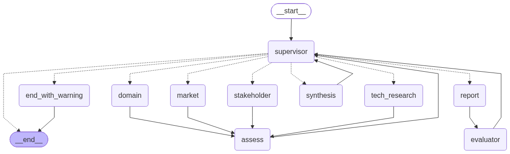

# KV cache 최적화 기술 다관점 평가 — Multi-Agent (Supervisor)

본 프로젝트는 KV cache 최적화 기술을 SW(KIVI), HW(InfiniGen) 두 진영에서 하나씩 선정하여,
**스마트폰 온디바이스 LLM** 도메인 안에서 기술 성숙도 · 시장 · 이해관계자 · 도메인 관점으로 평가하는
**Supervisor 패턴** 기반 Multi-Agent 이다. 우열을 판정하지 않고, 관점에 따라 평가가 어떻게 엇갈리는지를 드러낸다.

> SKALA 판교 10반 · 박유진 · 황재원 · 민영은 · 심준용 · 브랜치 `agent-supervisor` (RAG 과제 제출본은 `main`)
> 분담 · State 계약: [docs/ROLES.md](docs/ROLES.md) · 협업 규칙: [CONTRIBUTING.md](CONTRIBUTING.md) · RAG 설계서: [docs/설계서.md](docs/설계서.md)

## Overview
- Objective : 하나의 도메인(스마트폰 온디바이스 LLM)에서 두 기술을 4가지 관점으로 비교 평가
- Pattern : **Supervisor — Hybrid 판정 + 결정론 게이트.** 과제가 요구하는 "근거가 충분한가를 판단한 뒤 보고서 · 부족하면 해당 관점 재조사"가
  Supervisor 패턴의 정의와 같다. Orchestrator-Workers 의 동적 Fan-out 은 우리 작업 단위(4관점 × 2기술 = 8셀)가 처음부터 고정이라 계획 단계가 할 일이 없다.
  판정(충분성 · 보고서 품질)은 **규칙 → LLM Judge** 노드가 State 에 기록만 하고, 다음 담당은 **LLM 없는 게이트** `graph/supervisor.py` 가 정한다
  (교안 부록 B "판정은 확률에, 게이트는 결정론으로") — 같은 판정이면 같은 경로라서 재현된다
- 동적 처리 : 다음 노드가 고정 순서가 아니라 **매 턴 State 에서 계산**된다.
  ① 미수집 셀 → 그 워커 ② 충분성 Judge 가 부족으로 본 셀 → **그 워커의 그 기술만** 재작업(`rework_request` · 보강 질의 `hint_query`)
  ③ 보고서 품질 평가가 미달이면 `targets` 에 따라 보고서 재작성 / 종합 재실행 / **해당 관점 재조사 → 종합 → 보고서** 로 되돌림.
  그래서 실행마다 워커 호출 횟수 · 순서가 달라지고(정상 7턴, 최악 25턴), 상한을 다 쓰면 `end_with_warning` 으로 미달 항목을 보고서에 남기고 끝난다
- Tools : LangGraph, Chroma, BGE-M3, Tavily, LangSmith, RAGAS
- Frame : 판정은 배포 제약(재학습 불필요 · 전용 HW 불필요)으로, 해석은 **Recall · Latency · Memory 3축**으로 — 하나를 얻으면 하나를 내준다(KIVI 는 Recall 을, InfiniGen 은 Latency 를). 온디바이스는 Memory 가 절대 제약이라 "무엇을 포기했고 그 포기가 감당 가능한가"를 본다 (설계서 0.3 · 4.4)

## Selected Technologies
- SW : **KIVI** (ICML 2024) — 사후·무보정 2bit KV 양자화. 재학습 없이 배포된 모델에 즉시 적용, 피크 메모리 2.6× 감소. 정확도 trade-off 가 관점 대조 재료 (설계서 1.3)
- HW : **InfiniGen** (OSDI 2024) — 동적 KV 오프로딩·프리패치. 전용 HW 없이 메모리 계층을 쓰는 유일한 후보, 정확도 무손실 vs 전송·전력 (설계서 1.4)
- 선정 방식 : 조가 기준표(온디바이스 적용 가능성 · 자료 확보 · 성숙도 · 코퍼스 적합성)로 6편 비교 후 선정 — `config/selection.yaml`

## Features
- 논문 2편(33p) 기반 사실 추출 — 페이지 인용 `[p.N]`, 기술별 독립 검색(`tech` 필터)
- 한국어 질의 → 영어 논문 cross-lingual 검색 — **이중 질의 하이브리드**: dense(BGE-M3) 는 한국어 원 질의, BM25 는 영어 번역 질의, RRF 0.5/0.5, k=4
- 관련성 체크 → 질문 재작성 1회 → 실패 시 "논문에 근거 없음" 기록 (재작성 전/후 로그)
- 시장·이해관계자는 Tavily 웹검색, 도메인은 RAG + 웹 (HW 우호 반례 필수 수집)
- **근거 충분성 판정** (`assess`, Supervisor 층의 판정) : 셀(관점 × 기술)마다 결정론 규칙이 먼저 거르고, 통과한 셀만 LLM Judge 가 본다 — 기준은 "공통 기준 하나 + 자료 구조가 달라 공통 기준이 성립하지 않는 곳만 예외" (`graph/sufficiency.py` 상수 · [ROLES.md 2절 A](docs/ROLES.md))
  - 공통 : 워커 실패면 무조건 부족 · 근거 `[논문]`·`[웹]` **≥3** (`[추론]` 제외) · 반대 근거 **≥2** (`… 확보 실패 [추론]` 표시는 세지 않음)
  - 시장 · 이해관계자(웹만) : 출처 ≥2곳, 한 출처가 **과반**이면 편중 / 도메인(논문 + 웹 반례) : `[웹]` 근거 ≥1 (반례인지는 Judge) / 기술 조사(논문 1편) : 수치 · 한계 유무, 출처 다양성 제외
  - LLM Judge 4기준 : 주장↔근거 대응 · 관점 적합성 · 반대 근거의 실질 · 우열 판정 없음 → 부족하면 Judge 가 보강 질의(`hint_query`)를 써서 그 셀만 재작업
  - 지난 실행 데이터로 8셀 중 5셀 부족 (github 88% · 자기 논문 75% · 등급 근거 없음 · 웹 근거 0 · 시장 근거가 기술 수치뿐)
- 확증 편향 방지 장치 : ① 사전 가설 명시 ② 기술별 독립 호출 ③ 사실 단위 질의 ④ 정확도 임계값 없음 ⑤ 관련성 실패 → "근거 없음" 기록 ⑥ 출처 태그 강제 `[논문]/[웹]/[추론]` ⑦ 반대 근거 ≥2 — 부족하면 Supervisor 가 그 셀만 재작업 ⑧ 품질 평가의 중립성 · 편향 통제 항목 — 설계서 5.5
- **보고서 품질 평가** (`evaluator`, 보고서 **뒤** · 3안 Hybrid) : 1층 규칙(LLM 없음)이 먼저, 규칙을 통과한 항목만 2층 LLM Judge 가 문맥으로 다시 본다 (평가 1회당 Judge ≤1회) — `agents/evaluator.py`
  - Groundedness : 판단 문장 출처 태그 **≥90%** · `[추론]` 단독 **≤10%** · 본문 인용 ↔ REFERENCE 대응(arXiv URL 은 논문 id 로 정규화) → Judge 가 주장 샘플을 셀 근거와 대조
  - 중립성 : 직접 추천 · 우열 표현 규칙 검출 → Judge 가 문맥상 우열 판정인지 (synthesis 에 있던 중립성 Judge 를 여기로 옮김, #100)
  - 편향 통제 : 8셀 반대 근거 존재 · 웹 최다 출처 **≤40%** / 관점 커버리지 : 4관점 × 2기술 절 · SUMMARY · REFERENCE
  - 미달이면 항목별로 되돌릴 곳(`targets`)을 정한다 — 편향 · 커버리지는 **해당 셀 재조사**, 근거성 · 중립성은 **보고서 재작성**. 경로는 Supervisor 가 고른다(평가 루프 ≤2) <!-- C: 확인 -->
- 보고서 REFERENCE 는 실제 인용된 `citations` 에서만 자동 생성 · A4 10장 이하

## Tech Stack
- Framework : LangGraph 1.x (Python 3.11, uv)
- LLM/Generator : gpt-4.1-mini
- LLM/Judge : gpt-4.1-mini (temperature 0, Generator 와 별도 인스턴스) — 근거 충분성 · 보고서 품질(근거성 · 중립성) · 관련성 · Faithfulness · 질문 재작성 · 영어 번역 질의. 호출 1회 timeout 60초 · 재시도 2회
- Retrieval : Chroma(dense) + BM25(sparse) 이중 질의 하이브리드, RRF 0.5/0.5, k=4, Reranker 없음 — **Hit Rate@4 0.80 · MRR@4 0.52** (20문항, dense 단독 0.55/0.40 → [실측](experiments/sparse_compare/README.md)) — RAG 과제 실측값. Agent 과제에서 검색 파이프라인(rag/)은 바꾸지 않았다
- Embedding : `BAAI/bge-m3` (오픈소스, 로컬) — 후보 4개 대조군을 우리 코퍼스·한국어 질의로 실측해 선정 ([실측](experiments/embed_compare/README.md), 설계서 3.5)
- Generation eval : RAGAS **Faithfulness 0.936 · ResponseRelevancy 0.838 · ContextPrecision 0.912** (20문항)
- Web search : Tavily (시장 · 이해관계자 · HW 반례) · Observability : LangSmith `kv-cache-agent` (프로젝트 · 태그 · run_name 동일, #95) · 결정 로그 `outputs/decisions.jsonl`

> 설계서 3.6 의 nano(판단 없는 변환)는 미사용 — 유일한 변환 단계인 번역 질의가 검색 성패를 가르므로(nano 0.75 / mini 0.80) mini 로. Reranker 는 k=4 에서 목표 Hit@4 를 달성해 두지 않음 (설계서 3.4)

## Agents

| 층 | 노드 | 역할 | LLM | 쓰는 키 | 코드 |
|---|---|---|---|---|---|
| 게이트 | **Supervisor** | 판정 · 시도 횟수 · 상한만 보고 매 턴 다음 담당 1명 결정, 재작업 요청 · 사유 로그 | **없음** | `next` · `rework_request` · `step_count` · `retry` · `eval_attempts` · `status` | `graph/supervisor.py` `supervisor()` · `route()` |
| 게이트 | end_with_warning | 상한 소진 시 미달 항목을 보고서 끝 `## 자동 경고` 에 남기고 종료 | 없음 | `status` | `graph/supervisor.py` `end_with_warning()` |
| 판정 | 충분성 판정 | 셀별 규칙 → LLM Judge | Judge | `sufficiency` | `graph/sufficiency.py` `assess()` |
| 판정 | 품질 평가 | 보고서 4항목 규칙 → LLM Judge, 미달 시 되돌릴 곳(`targets`) · `feedback` | Judge | `eval_result` | `agents/evaluator.py` |
| 워커 | 기술 조사 | 논문에서 개요·메커니즘·수치·한계·적용조건 추출 (기술별 독립) | Generator | `tech_summary` | `agents/tech_research.py` |
| 워커 | 시장 평가 | 시장 규모·채택·생태계 (Tavily) | Generator | `market_eval` | `agents/market.py` |
| 워커 | 이해관계자 평가 | 경쟁 진영·개발자·투자 반응, 찬반 각 ≥2 (Tavily) | Generator | `stakeholder_eval` | `agents/stakeholder.py` |
| 워커 | 도메인 평가 | 논문 사실 → 온디바이스 제약 판정, HW 반례 웹검색 | Generator | `domain_eval` | `agents/domain.py` |
| 워커 | 평가 종합 | 관점 × 기술 매트릭스, 일치/상충, TRL | Generator | `synthesis` · `trl_estimate` | `agents/synthesis.py` |
| 워커 | 보고서 생성 | 6장 목차 md → PDF, `feedback` 반영 재작성 | Generator | `report_uri` | `agents/report.py` |

워커는 **자기 출력 키 + `citations` + `llm_calls` 만** 반환한다. `next` · `retry` · `sufficiency` · `eval_result` 는 쓰지 않는다 — 워커끼리 직접 통신하지 않고 전부 Supervisor 층으로 돌아온다.

### Supervisor 우선순위 — `graph/supervisor.py` `_decide()`

| | State 조건 | next |
|---|---|---|
| 0 | `step_count ≥ max_steps` | `end_with_warning` |
| 1 | 미수집 셀 (선행 단계 먼저 — 기술 조사가 나머지 워커의 입력) | 해당 워커 |
| 2 | 부족 셀 (`rule == fail` 또는 `judge == insufficient`), 셀 재작업 < 2, 예산 안 — **라운드 로빈**: 재작업 횟수가 적은 셀부터 | 해당 워커 + `rework_request{worker, tech, gap, hint_query}` |
| 3 | `synthesis` 없음 | 평가 종합 |
| 4 | 보고서 없음 | 보고서 생성 → 품질 평가 (엣지 고정) |
| 5 | 평가 pass | `END` — 단 실패 노드가 남아 있으면 `end_with_warning` |
| 6 | 평가 fail, 평가 루프 < 2, 예산 안 | `targets` 의 첫 실행 가능한 곳: `report` / `synthesis` / `{관점}:{기술}` 재조사 (종합 · 보고서를 비워 다시 흐르게) |
| 7 | 평가 fail 소진 · 예산 초과 | `end_with_warning` |

이 표는 "1 → 2 → 3 → 4 를 차례로 부른다"가 아니다. 같은 턴에 어떤 조건이 참인지는 판정 결과(LLM Judge)에 달려 있어서,
재작업이 몇 번 · 어느 셀에 걸릴지, 평가 루프가 어디로 되돌아갈지는 실행마다 다르다. 순서는 **우선순위**(선행 조건)일 뿐 경로가 아니다.

게이트의 조건은 **에이전트 수에 비례해 늘지 않는다.** 재작업 판단은 모든 셀에 같은 조건 하나("부족 · 재작업 < 2 · 예산 안")이고,
관점마다 다른 것("무엇이 충분한가")은 판정 노드(`assess` 의 기준)에, 에이전트 목록과 선행 조건은 데이터(`WORKERS` · `PAYLOAD` · `STAGES`)에 있다 —
관점을 하나 늘려도 게이트에 `if` 가 생기지 않는다. "무엇이 충분한가"는 관점마다 다르게(판정), "몇 번까지 · 언제 멈추나"는 똑같이(게이트).

## State Schema

정의: [`graph/state.py`](graph/state.py) — 계약 원문은 [docs/ROLES.md 4절](docs/ROLES.md). State 는 "에이전트가 다음을 정하기 위한 인터페이스"로 짜고, 로그 · 본문은 밖에 둔다.

| 구역 | 키 | 누가 쓰나 |
|---|---|---|
| 페이로드 | `domain` · `selected` · `tech_summary` · `market_eval` · `stakeholder_eval` · `domain_eval` · `trl_estimate` · `synthesis` · `report_uri` · `citations` | 워커 |
| 판정 | `sufficiency` (셀 `"market:InfiniGen"` → `CellVerdict`) · `eval_result` (`EvalResult`) | assess · evaluator |
| 제어 | `trace_id` · `next` · `rework_request` · `step_count` · `max_steps` · `retry` · `eval_attempts` · `llm_calls` · `tokens` · `status` · `node_status` · `errors` · `last_error` | Supervisor (safe 래퍼는 `node_status` · `errors` · `last_error` 만) |

- **제어 vs 페이로드 분리** : 위 3구역. 게이트는 판정 · 제어 키만 읽고, 워커는 페이로드만 쓴다. 판정(`sufficiency` · `eval_result`)을 별도 구역으로 둬서 "판정은 Judge 가 쓰고 경로는 게이트가 정한다"가 키 소유로 강제된다. 라우팅에 필요한 최소 상태 = 셀별 판정 + 셀별 재작업 횟수 + 평가 루프 횟수 + 상한
- **관측성 위치** : 결정 로그는 State 에 넣지 않는다. Supervisor 가 매 턴 `observe.log_decision(state, node, decision, reason)` 으로 `{trace_id, node, decision, reason, ts}` 를 `outputs/decisions.jsonl` · LangSmith run metadata 에 외부 적재 (`graph/observe.py`). State 에는 게이트가 다음 턴에 다시 읽어야 하는 것(`rework_request` 의 `gap` · `hint_query`)만 남는다. 실행 하나의 라우팅 · 셀 재작업(회차별 판정 변화) · 품질 평가는 `uv run python -m graph.run_summary <trace_id>` 로 한 장에 정리된다 (Run Record 근거)
- **지속성 비용** : 체크포인터는 매 슈퍼스텝 State 전체를 저장하므로 커지는 것은 밖으로 뺀다 — 보고서 본문은 파일(`outputs/report/report.md`)이고 State 에는 `report_uri` 만, 검색 로그는 `outputs/retrieval_log.jsonl`, `evidence` 는 원문 청크가 아니라 인용 문장 + 페이지. 누적 리스트는 `citations` · `errors` 둘뿐이고 둘 다 실행당 수십 건 상한(호출 예산에 묶임)
- **상관** : 실행 시작 시 `trace_id` 하나를 만들어 State(`trace_id`) · 체크포인터(`thread_id`) · LangSmith(`metadata.trace_id` · `run_name`) · 결정 로그 · `outputs/run.json` 에 같은 값으로 단다 (`app.py`)
- **재개/복구** : 체크포인터가 매 슈퍼스텝 저장(`thread_id = trace_id`) → `python app.py --resume <trace_id>` 는 성공한 노드를 다시 돌지 않고 이어 간다. 노드 예외는 `graph/safe.py` 가 형식을 지킨 실패 기록 + `node_status[node] = "failed"` · `last_error` · `errors` 로 바꾼다 — fallback 이 정상 결과처럼 보이지 않게, 충분성 규칙은 실패 셀을 무조건 부족으로 보고 재작업, Supervisor 는 실패 노드가 남은 채로 END 하지 않는다
- **동시 처리** : 같은 슈퍼스텝에 둘 이상이 쓸 수 있는 키는 전부 리듀서 — `*_eval` · `tech_summary` 는 기술 단위 병합 `merge_by_tech`(한 기술만 재작업해도 다른 기술 결과가 남는다), `sufficiency` · `retry` · `node_status` 는 키 병합, `citations` · `errors` · `step_count` · `llm_calls` · `tokens` 는 `operator.add`. 리듀서 없는 키에 둘이 쓰면 `InvalidUpdateError` 로 멈춘다 (`tests/test_state.py`). 매 턴 워커 1명이라 워커끼리는 겹치지 않지만 워커 · safe · assess 가 같은 키에 연달아 쓴다
- **종료 보장** : 전부 코드 상수 (`graph/supervisor.py` · `app.py` · `agents/_common.py`). 턴 상한은 구조에서 계산하고, 비용 · 시간 상한은 실측에 여유를 둔다

  | 상한 | 값 | 넘으면 | 정한 방법 |
  |---|---|---|---|
  | `MAX_STEPS` (Supervisor 턴) | 30 | `end_with_warning` | 구조 — 기본 7 + 8셀 × `MAX_REWORK` + `MAX_EVAL` × 3 + 1 |
  | `MAX_REWORK` (셀별 재작업) | 2 | 그 셀은 소진 — 다음 단계로, 보고서 한계점에 기록 | 관행값 — 실측에서 "2회째가 판정을 바꿨나"(run_summary)로 검증 |
  | `MAX_EVAL` (품질 평가 루프) | 2 | `end_with_warning` | 〃 |
  | `TOKEN_BUDGET` (`tokens`) | 600,000 ⚠️잠정 | 재작업 · 평가 루프 중단 — `FINAL_RESERVE` 80,000 을 남겨 종합 · 보고서 · 평가는 끝까지 | (기본 경로 + Σ부족셀 재작업단가[워커] + 평가 루프 × `MAX_EVAL`) × 1.2~1.5, 첫 실측으로 확정 (#102) |
  | `LLM_BUDGET` (`llm_calls`) | 150 | 〃 | 호출 수 안전망 (#29) — 토큰 예산 확정 후 제거 여부 결정 |
  | `RECURSION_LIMIT` (LangGraph) | 100 = 3 × MAX_STEPS + 10 | 그래프 예외 | 파생 — 턴당 노드 ≤3 |
  | `RUN_TIMEOUT` (벽시계, `app.py`) | 3,600초 ⚠️잠정 | 노드 경계에서 멈춤 → `INTERRUPTED`, `--resume` | 실측 소요 × 1.5 (지난 RAG 실행이 PC 에 따라 186 ~ 1,556초 — 그래서 넉넉히). **게이트 밖** — 게이트가 시계를 읽으면 같은 State 에서 다른 결정이 나온다 |
  | LLM 호출 1회 (`agents/_common.py`) | 60초 · 재시도 2 | 그 호출 실패 → 노드 실패 기록(safe) | 노드 안의 멈춤을 끊는 1차 방어 (기본값이 600초라서) |

  부족 셀은 **라운드 로빈**(재작업 횟수가 적은 셀부터)이라 예산이 바닥나도 뒤쪽 관점(도메인)이 먼저 잘리지 않는다.
  정상 경로 7턴, 8셀 전부 부족 + 평가 매번 fail 인 최악 25턴 (`tests/test_supervisor.py` · `tests/test_build.py`)

## Architecture



`python -m graph.build` 가 그린 컴파일 결과. 셀 워커 4개 → `assess` → `supervisor`, `synthesis` → `supervisor`, `report` → `evaluator` → `supervisor`,
`supervisor` 의 조건부 엣지가 워커 6 · `end_with_warning` · `END` 로 나간다 (`add_conditional_edges` 목적지 = `route()` 의 `Literal`).

RAG 파이프라인: [전처리](docs/images/pipeline_pre.png) · [검색·관련성](docs/images/pipeline_ret.png) · [생성·사실성](docs/images/pipeline_gen.png)

## Directory Structure

```
├── app.py                 # 실행 스크립트 — trace_id · 체크포인터 · 그래프 실행 → outputs/ (--resume)
├── graph/                 # state.py(State 계약) · supervisor.py(게이트) · sufficiency.py(충분성 판정) · observe.py(결정 로그) · run_summary.py(실행 요약) · safe.py · build.py
├── agents/                # 워커 6개 — run(state) -> dict · evaluator.py(품질 평가)
├── rag/                   # indexing · retriever · judge · rag_node(ask) · evaluate
├── prompts/               # 에이전트별 프롬프트 .md + rubrics/(4.1~4.5)
├── config/                # domain.yaml(0.3 환경) · selection.yaml(1장 선정)
├── data/                  # papers/(논문 PDF, git 제외) · index/ · cache/
├── experiments/           # 임베딩 실측(embed_compare) · sparse 비교
├── outputs/               # report/(보고서 md·PDF) · run.json · decisions.jsonl(결정 로그) · retrieval_log.jsonl(검색 로그) · run_summary.md · checkpoints.sqlite
├── tests/                 # LLM 없이 도는 테스트 — supervisor 우선순위 · 종료 보장 · fixtures stub 으로 그래프 START→END
├── scripts/               # fetch_papers.sh
├── docs/                  # 설계서.md · ROLES.md · images/
└── README.md
```

## Usage

```bash
uv sync --extra pdf              # Python 3.11, .venv — md→PDF 는 weasyprint(brew install pango)
cp .env.example .env             # OPENAI_API_KEY · TAVILY_API_KEY · LANGSMITH_API_KEY
bash scripts/fetch_papers.sh     # arXiv 2402.02750, 2406.19707 → data/papers/
uv run python -m rag.indexing    # BGE-M3 임베딩(첫 실행 시 모델 다운로드) → data/index/
uv run python app.py             # 그래프 실행 → outputs/report/report.md (+ .pdf) — 시작할 때 trace_id 를 출력
#   --skip-index                    인덱싱 건너뜀 / --pdf-name <파일명>  제출용 PDF 이름
#   --resume <trace_id>             체크포인트에서 이어서 (outputs/checkpoints.sqlite)
#   --timeout <초>                  벽시계 상한 (기본 RUN_TIMEOUT)
#   실패해도 outputs/run.json (trace_id · status · visited · step_count · retry · eval_attempts · llm_calls · tokens · node_status) 과
#   채워진 State 키의 .json 은 남는다
uv run python -m graph.run_summary --md   # 마지막 실행 요약 → outputs/run_summary.md (Run Record 표 · 캡처할 실행 고르기)
uv run python -m agents.report   # 보고서 워커만 fixtures 로 단독 실행 (LLM 4회)

uv run python -m rag.evaluate    # Hit Rate@4 · MRR@4 · RAGAS
uv run pytest                    # 단위 테스트
```

## Contributors
- 박유진 : 근거 충분성 판정(규칙 + LLM Judge · 기준 설계), 관측성(trace_id · 결정 로그 · 검색 로그 외부화 · 실행 요약), 기술 조사 Agent(재작업), RAG Pipeline
- 심준용 : 시장 · 이해관계자 Agent 재작업, 보고서 생성 Agent, LangSmith Tracing 실증
- 민영은 : 품질 평가 노드(Groundedness · 중립성 · 편향 · 커버리지), 도메인 · 종합 Agent
- 황재원 : Supervisor 게이트 · State Schema · Graph · 체크포인터 · 실행 예산(토큰 · 라운드 로빈 · 시간 상한), README 취합

## Run Record — Agent 과제 전체 실행

<!-- B: 통합 실행 후 갱신. `uv run python -m graph.run_summary --md` 상단 표를 그대로 쓰면 칸이 다 채워진다. 캡처 규칙은 ROLES.md 5-1 (trace_id 하나 · tracing-N.png 시간순) -->

| 항목 | 값 |
|---|---|
| 실행 | `uv run python app.py --skip-index --pdf-name "..."` · trace_id `…` |
| 경로 | `outputs/run.json` 의 `visited` — 재작업 · 평가 루프가 찍힌 곳 |
| Supervisor | step_count … / 30 · 셀 재작업 `retry` … · 평가 루프 `eval_attempts` … / 2 · `status` … |
| LLM 호출 · 토큰 | … / 150 · tokens … / TOKEN_BUDGET · Tavily … 회 |
| LangSmith | [docs/tracing/](docs/tracing/) `tracing-1.png` ~ |
| 보고서 | … 쪽 · 품질 평가 항목별 결과 … |

RAG 과제(`main`)의 Run Record 는 [main 브랜치 README](https://github.com/TurtleNeck-Crew-RAG/kvcache-agentic-rag/tree/main#run-record--전체-실행-2026-09-22-7회차--제출본) 에 있다.


## Lessons Learned

<!-- Agent 과제 항목은 통합 실행 후 위에 추가. 아래는 RAG 과제(2026-09-22) — 설계와 달라진 것 · 실측이 가설을 뒤집은 것 · 다음에 다르게 할 것 (2026-09-22 통합 실행 7회 기준) -->

* **검색**: 설계서 3.4에서는 sparse 검색의 초기 모델로 BGE-M3 learned sparse를 사용했다. 하지만 실제로 측정해 보니 예상과 다른 결과가 나왔다. 한국어 질의에 sparse 검색을 섞었을 때 dense 단독보다 성능이 낮아졌다(0.55→0.45). 해결 방법은 sparse 모델을 바꾸는 것이 아니라 **질의 언어를 분리하는 것**이었다(dense ← 한국어, BM25 ← 영어 번역). 결국 리더보드만 볼 것이 아니라, 실제로 사용하는 질의로 직접 측정해야 정확한 성능을 알 수 있었다([실측](experiments/sparse_compare/README.md))

* **호출 상한**: 설계서 5.1에서는 종료 조건의 호출 상한을 100회로 설정했다. 하지만 번역 질의가 추가되면서 ask 호출이 3회에서 4회로 늘어났고, fan-out 직후 호출 횟수가 약 95회에 도달했다. 이 때문에 실패한 작업을 다시 시도할 여유가 부족했다. 그래서 호출 상한을 **150회**로 늘렸다(#29). 전체 실행에서 실제 호출 횟수는 102회였다.

* **워커 예외는 형제를 지운다**: LangGraph의 병렬 fan-out에서 워커 하나에 예외가 발생하면, 같은 슈퍼스텝에서 실행된 다른 워커의 결과까지 State에서 사라지는 문제가 있었다(통합 1·2회차). 워커 내부에 `try/except`를 넣는 것만으로는 이 문제를 막을 수 없었다. 그래서 **그래프 층 안전 래퍼**(`graph/safe.py`)를 추가해, 예외를 그래프 전체의 실패가 아니라 해당 워커 키의 실패 기록으로 바꿨다. 그 결과 미구현 워커가 3개 있어도 그래프가 END까지 실행되어 PDF가 만들어졌다(3회차).

* **validator가 너무 엄격하면 근거가 있어도 버린다**: 출처 태그 검증이 `[논문 p.N]` 형식만 허용하고 있었다. 이 때문에 `[논문 p.2, p.9]`처럼 여러 페이지를 표시한 정상적인 출력도 오류로 처리되었다. 그 결과 도메인 워커와 종합 워커가 통째로 실패했다(5회차). 이를 해결하기 위해 구체적인 표기 형식이 아니라 **출처 태그의 종류만** 검사하도록 검증 조건을 완화했다. 다만 장치 6의 출처 태그 강제 규칙은 그대로 유지했다.

* **한계점 수치는 워커 출력 형식에 묶인다**: `[추론]` 비율이 처음에는 100%(1/1)로 계산되었다. 워커가 `[추론]` 태그를 문장에 직접 표시하지 않고 `evidence[].tag`에 저장하는 경우가 있었기 때문이다. 집계 로직을 수정해 두 가지 출력 형식을 모두 확인하도록 바꾸자 실제 비율은 5%(7/145)로 계산되었다. 즉, “측정 가능한 한계점”을 만들려면 수치만 정할 것이 아니라, 해당 수치를 계산할 수 있도록 출력 스키마도 함께 설계해야 한다.

* **REFERENCE는 citations를 그대로 찍으면 안 된다** : 설계서 6장에서는 citations 스키마를 지정된 형식으로 렌더링하면 된다고 생각했다. 하지만 7회차 결과를 확인해 보니, REFERENCE 11건 중 4건은 Tavily가 수집한 arxiv.org 페이지가 ‘웹’ 항목으로 들어간 것​이었다. 이 때문에 선정 논문 2편이 저자 미상(접근일). *제목*. arxiv.org, URL 형식으로 한 번 더 표시되어 중복이 생겼다. 이를 해결하기 위해 렌더링 전에 정규화 단계를 추가했다(agents/report_render.py의 normalize_citations). URL에서 arXiv ID를 찾으면 논문 항목으로 바꾸고, 같은 ID를 가진 항목은 학회 정보가 있는 쪽 하나로 합쳤다. 선정 논문 2편은 selection.yaml의 저자·학회 정보를 사용했다. 선정 논문 목록 밖의 논문은 arXiv API를 통해 저자와 게시 연도를 채우고, 학회는 arXiv로 표시했다. 나머지 웹 항목도 저자 미상 대신 기관명(게시일 미상 · 접근일) 형식으로 바꿨다. 그 결과 참고문헌이 11건에서 8건(논문 3 · 웹 5)으로 정리되었다. 출처 형식은 각 워커가 따로 처리하기보다 ​보고서 생성 단계에서 한 번에 정리하는 것이 적절했다.
* **다음에 다르게 할 것**: ① 도메인 워커가 항상 정해진 언어로 답하도록 프롬프트에 출력 언어를 명시한다(InfiniGen 판정이 영어로 출력된 사례가 있었다). <br>
② [추론] 비율과 재작성 효과처럼 한계점에 사용할 수치는 State 스키마를 정할 때 집계 방법까지 함께 정한다.<br>
③ 통합 실행을 첫날 오전에 한 번 돌린다. 안전 래퍼가 있으면 일부 워커가 구현되지 않아도 전체 실행이 가능하므로, 형제 워커의 결과가 사라지는 문제도 더 일찍 발견할 수 있었을 것이다.
