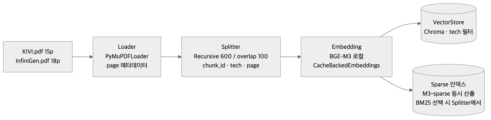
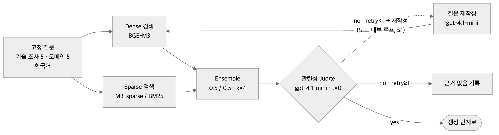
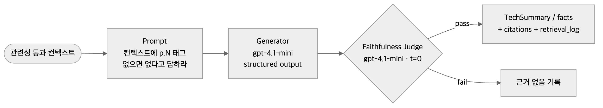

# KV cache 최적화 기술 다관점 평가

## Agentic RAG 설계서

| **항목** | **내용** |
|---|---|
| 과제 | RAG Pipeline 설계 및 구축 — KV cache 최적화 기술 다관점 평가 (SW 압축 vs HW 메모리 접근) |
| 산출물 | RAG-Design (설계 산출물) |
| 소속 | SKALA 판교 10반 |
| 작성자 | 박유진 · 황재원 · 민영은 · 심준용 |
| 작성일 | 2026-09-21 |
| 버전 | 1.0 (설계 제출본) |

**근거 표기** — [실측] 직접 측정한 값 / [추론] 팀의 판단 (보고서에도 추론임을 명시)

## 목차

0. 문제 정의 — 도메인 선정 / 1. 대상 기술 / 2. Agent 정의 / 3. 설계 / 4. 평가 관점 및 기준 / 5. 그래프 설계 / 6. 평가 보고서 / 7. 부록

## 설계 요약

| **항목** | **결정** | **근거** |
|---|---|---|
| 도메인 | 스마트폰 온디바이스 LLM (Galaxy AI / Apple Intelligence급, RAM 8~16GB) | 메모리 확장 불가·재학습 불가 제약이 구체적이고, SW·HW 평가가 구조적으로 갈리는 도메인 (0.2) |
| SW 기술 | KIVI — 사후·무보정 2bit KV 양자화 | 배포된 모델에 즉시 적용, 피크 메모리 2.6× 감소, 정확도 trade-off가 관점 대조 재료 (1.3) |
| HW 기술 | InfiniGen — 동적 KV 오프로딩·프리패치 | 전용 HW 없이 메모리 계층을 쓰는 유일한 후보, 정확도 무손실 vs 전송·전력 (1.4) |
| 기술 선정 방식 | 2안 Human — 조가 기준표로 6편 비교 후 선정 | 개발 범위 고정, 재현성 (3.2) |
| RAG 적용 | 기술 조사 + 도메인 평가 (인덱스 1개, 논문 2편 33p) | 논문에 답이 있는 관점에만 적용. 시장·이해관계자는 웹검색 (3.3) |
| 임베딩 | BGE-M3 (오픈소스, 로컬) | 한국어 질의→영어 논문 cross-lingual, max_seq 8192, 자체 실측 ko Hit@4 0.65로 후보 중 최고 (3.5) |
| 검색 | Sparse + Dense 하이브리드 k=4, Reranker 없음 | 실측 실패 유형이 고유명사·숫자 → sparse 보완. M3-sparse vs BM25 비교 후 확정 (3.4) |
| 평가 기준 | 관점별 에이전트용 Rubric 4종 + 종합 Rubric | 정확도에 임계값 없음 — 관점별 해석 차이가 상충의 재료 (4) |
| 그래프 | Branching(fan-out/fan-in) + Loop, 규칙 기반 Dispatcher | 관점 3개 항상 전부 실행, 루프 3개 상한 명시, LLM 라우팅 없음 (5) |
| 편향 방지 | 사전 가설 명시 + 장치 8개 | 기술별 독립 호출, 사실 단위 질의, 출처 태그, 반대 근거 ≥2, 중립성 검증 (5.5) |
| 보고서 | SUMMARY ~ 6장 ~ REFERENCE | 우열 판정 없이 관점 × 기술 매트릭스의 상충 중심 (6) |

## 0. 문제 정의 — 도메인 선정

### 0.1 문제

KV cache는 LLM이 다음 토큰을 생성할 때 이전 토큰의 Key와 Value를 저장해 두는 방식이다. 이미 처리한 토큰을 매번 다시 계산하지 않아도 된다는 장점이 있지만, 문맥이 길어질수록 저장해야 하는 데이터도 함께 증가한다. 결과적으로 연산량은 줄어드는 대신 메모리 사용량이 증가하는 문제가 발생한다.

이를 해결하기 위한 두 가지 접근

- **SW:** 데이터를 작게 만들자: 압축·양자화·아키텍처 개선

- **HW:** 담을 공간을 넓히자: 메모리·스토리지 계층 확장

**본 과제:** 두 접근에서 기술을 1개씩 선정해, 하나의 도메인 안에서 시장·이해관계자·도메인·기술성숙도 관점으로 비교한다. 두 기술의 우열을 판정하는 것이 아니라, 동일한 관점에서 서로 다른 접근이 어떻게 평가되는지를 분석한다.

### 0.2 도메인 선정 — 스마트폰 온디바이스 LLM

도메인은 **On-Device AI** 1개로 한정하고, **스마트폰 온디바이스 LLM** (Galaxy AI / Apple Intelligence급 기기)으로 구체화한다.

**선정 이유**

**SW·HW 접근의 차이가 명확하다.**<br>데이터센터는 서버 메모리나 가속기를 추가해 저장 공간을 확장할 수 있지만, 스마트폰은 출시 이후 물리적인 메모리를 늘리기 어렵다. 따라서 SW는 KV cache 자체를 압축하는 방향으로, HW는 플래시 메모리 등 다른 메모리 계층을 활용하는 방향으로 접근하게 된다.

**자원 제약이 명확해 기술을 구체적으로 비교할 수 있다.**<br>스마트폰은 메모리 용량과 전력 사용량 등 사용 가능한 자원이 제한적이다. 따라서 각 기술이 KV cache의 메모리 사용량을 얼마나 줄이는지뿐만 아니라, 그 과정에서 추론 속도와 전력 사용량 등에 어떤 Trade-off가 발생하는지 비교할 수 있다.

**관련 사례와 시장 자료가 충분하다.**<br>Apple Intelligence, Galaxy AI, Gemini Nano, Qualcomm AI Engine 등 주요 기업의 온디바이스 AI 사례가 존재하며, LPDDR-PIM이나 플래시 메모리를 활용한 LLM 추론 기술도 연구되고 있다. 따라서 SW 압축 방식뿐만 아니라 HW 접근이 효과를 보이는 사례도 함께 검토할 수 있다.

**대표 시나리오**

RAM 12GB 스마트폰에서 가중치가 4bit로 양자화된 7B 모델을 실행하고, 8K 토큰 분량의 문서를 요약한다고 가정한다. 모델 가중치는 약 3.5GB이지만 fp16 KV cache는 약 4GB까지 증가한다. 여기에 운영체제와 다른 애플리케이션의 메모리 사용량을 고려하면 실제 가용 메모리는 빠르게 줄어든다.

이 상황에서 **KIVI**는 KV cache를 2bit로 양자화해 메모리 사용량을 줄이고, **InfiniGen**은 KV cache를 다른 메모리 계층으로 옮긴 뒤 필요한 데이터를 미리 가져오는 방식을 사용한다. 두 기술이 제한된 메모리 문제를 해결하는 과정에서 **메모리 사용량, 추론 성능, 전력 사용량 등에 어떠한 Trade-off가 발생하는지 비교한다.**

### 0.3 스마트폰 온디바이스 LLM — 환경 정의

| **제약** | **구체** |
|---|---|
| 메모리 | 통합 메모리 8~16GB, HBM 없음, 확장 불가. OS·앱과 공유 |
| 전력·발열 | 배터리 구동, 지속 수 W. 메모리 전송도 전력 비용 |
| 배포 | 모델은 벤더가 OTA 배포. 기기에서 재학습·파인튜닝 불가 |
| 품질 | 어시스턴트 응답 품질 = 제품 품질 → 압축 손실에 민감 |

**왜 KV cache가 이 도메인의 병목인가** [추론, 수치는 공식 계산]

7B 모델(32 layer, hidden 4096, fp16, MHA)을 기준으로 KV cache는 토큰당 약 0.5MB가 필요하다.

KV = 2 × 32 × 4096 × 2B ≈ 0.5MB/token

4K 컨텍스트 ≈ 2GB / 8K ≈ 4GB / 32K ≈ 16GB

최근 모델에서 주로 사용하는 GQA는 KV head 수가 적어 실제 사용량이 이보다 작다. 예를 들어 Llama 3 8B(KV head 8)는 토큰당 약 0.125MB를 사용한다. 절대적인 크기에는 차이가 있지만, **문맥 길이에 비례해 KV cache가 증가한다는 점은 동일하다.**

온디바이스 모델은 가중치를 4bit로 양자화해 7B 모델도 약 3.5GB까지 줄일 수 있다. 반면 KV cache는 문맥이 길어질수록 계속 증가하므로, 긴 대화나 문서를 처리할 때 제한된 스마트폰 RAM에서 주요 병목으로 작용할 수 있다.

**Recall · Latency · Memory 3축**

본 과제에서는 두 기술을 다음 세 가지 기준으로 평가한다.

- **Recall:** 필요한 정보가 얼마나 보존되는가

- **Latency:** 추론 과정에서 발생하는 지연은 어느 정도인가

- **Memory:** KV cache가 차지하는 메모리를 얼마나 줄이는가

KV cache를 압축하면 정보 손실로 Recall이 감소할 수 있고, 다른 메모리 계층을 활용하면 데이터 이동으로 Latency가 증가할 수 있다. 특히 스마트폰은 물리적인 메모리 확장이 어렵기 때문에 Memory가 강한 제약으로 작용한다.

따라서 어느 기술이 우월한지를 판단하기보다, **각 기술이 Memory를 확보하는 과정에서 Recall과 Latency에 어떤 Trade-off를 가지며 그 비용이 스마트폰 환경에서 수용 가능한지**를 비교한다.

## 1. 대상 기술 — 후보 비교와 선정 사유

### 1.1 선정 기준표 (도메인 제약에서 도출)

| **선정 기준** | **판단 내용** |
|---|---|
| 온디바이스 적용 가능성 | 별도의 학습이나 전용 하드웨어 없이 기존 모델에 적용할 수 있는가 |
| 평가 자료 확보 가능성 | 오픈소스 구현, 후속 연구, 개발자 논의, 제품 적용 사례 등 시장·이해관계자·도메인·기술 성숙도를 평가할 자료가 충분한가 |
| 기술 성숙도 | TRL을 기준으로 두 기술의 성숙 수준을 비교하고, 공개 시점이나 개발 단계의 차이로 인해 비교가 불공정해지지 않는가 |
| RAG Corpus의 적합성 | KV cache가 논문의 주제인가, 2편 합쳐 200p 이내 |

### 1.2 후보 검토와 선정 경위

문서 풀 6편을 1.1 기준으로 검토한 결과. 검토 내용은 각 논문 본문에서 확인한 사실이며, 판단은 [추론]으로 표시한다.

| 진영 | 후보 (arXiv · 게재 · 분량) | 논문에서 확인한 내용 | 선정 |
|---|---|---|---|
| SW | **KIVI** (2402.02750 · ICML 2024 · 15p) | 추론 시점에 Key는 채널별, Value는 토큰별로 2bit 양자화. 재학습·보정 데이터 없음. 공식 구현 공개(github.com/jy-yuan/KIVI). 후속 연구 TurboQuant가 비교 대상으로 사용 | **선정** |
| SW | TurboQuant (2504.19874 · 2025-04 · 25p) | KIVI와 같은 사후 양자화. KIVI·PolarQuant·SnapKV를 베이스라인으로 실험. 오픈소스 구현 다수, vLLM 통합 PR 진행 | 미선정 — HW 후보(2024)와 1년 시차(1.1 기준). KIVI의 경쟁 기술로 4.3에서 다룸 [추론] |
| SW | DeepSeek-V2 MLA (2405.04434 · 52p) | 사전학습 단계에 도입되는 어텐션 구조(논문 2.1절). KV cache 93.3% 감소. 배포된 모델에 사후 적용하는 방법은 논문에 없음. KV 관련 내용은 52p 중 2.1절 | 미선정 — 기존 모델 적용 불가, 코퍼스 적합성 낮음 |
| HW | **InfiniGen** (2406.19707 · OSDI 2024 · 18p) | KV cache를 CPU 메모리에 두고 다음 레이어에 필요한 KV만 예측해 프리패치. 기존 오프로딩 대비 최대 3.00×. 추가 하드웨어 없이 GPU + CPU DRAM 사용 | **선정** |
| HW | ITME (2606.12556 · 13p) | CXL-hybrid 메모리로 분산 클러스터의 TB급 컨텍스트를 공유 | 미선정 — CXL·서버 클러스터 전제 |
| HW | PIM/CXL PNM (2511.00321 · 13p) | CXL 메모리 내 PNM 가속기가 토큰 페이지 선택을 수행, 1M 토큰 추론 대상 | 미선정 — CXL 전제. 모바일 PIM(LPDDR-PIM)은 4.3 반례 자료로 |

- SW: 세 편 중 배포된 모델에 재학습 없이 적용되는 것은 KIVI·TurboQuant. 둘 중 HW 후보와 공개 시점이 맞고 후속 연구의 비교 기준이 되는 KIVI 선정
- HW: ITME·PNM은 스마트폰에 없는 CXL을 전제해 도메인 질문이 성립하지 않음. InfiniGen은 기존 메모리 계층만 쓰므로 스마트폰의 DRAM–플래시 계층에 대응시켜 검토 가능 [추론]
- 시점·분량: KIVI(ICML 2024)와 InfiniGen(OSDI 2024)은 같은 해 게재. 두 편 합쳐 33p로 RAG 예산 200p 이내 [실측]

### 1.3 SW — KIVI 선정 사유

KIVI는 별도의 재학습 없이 기존 모델의 KV cache에 적용할 수 있어 온디바이스 환경에 적합하다. Key는 채널별, Value는 토큰별로 2bit 양자화하여 피크 메모리를 최대 2.6배 줄이면서 Llama·Mistral 계열에서 정확도 하락을 최대 2%로 억제했다(MQA 구조인 Falcon은 4bit가 필요). 공식 구현이 공개되어 있고 TurboQuant 등 후속 연구가 비교 대상으로 삼고 있어 기술 성숙도와 시장성을 함께 분석하기에 적절하다.

### 1.4 HW — InfiniGen 선정 사유

InfiniGen은 KV cache를 상대적으로 저렴한 CPU 메모리에 저장하고, 다음 연산에 필요한 데이터만 예측해 GPU로 가져오는 방식으로 전송량을 줄인다. 논문의 실험은 GPU–CPU 메모리(PCIe) 환경이며, 이를 스마트폰의 통합 메모리·플래시 계층에 대응시켜 적용 가능성을 검토한다[추론]. KIVI가 정확도를 일부 포기해 메모리를 줄인다면, InfiniGen은 원본 KV를 유지하는 대신 호스트–GPU 전송 지연을 감수한다는 점에서 서로 다른 절충 관계를 비교하기에 적합하다.

## 2. A. Agent 정의

가이드 표를 바탕으로 역할과 도구를 조정했다.

| **에이전트** | **역할** | **RAG** | **도구** | **출력 키** | **담당** |
|---|---|---|---|---|---|
| Dispatcher (조정 노드) | 워커 호출·결과 수집·재호출 여부를 State 검사 규칙으로 결정. LLM 없음, 워커를 건너뛰지 않음 | — | — | `next`, `retry` | 황재원 |
| 기술 조사 | 선정 논문에서 개요·메커니즘·수치·한계 추출 (기술별 독립 호출) | **O** | retriever(`tech` 필터) | `tech_summary` | 박유진 |
| 시장 평가 | 시장 규모·채택·생태계 | X | Tavily | `market_eval` | 심준용 |
| 이해관계자 평가 | 경쟁 진영·개발자·투자 반응, 찬반 각 ≥2 | X | Tavily | `stakeholder_eval` | 심준용 |
| 도메인 평가 | 논문 사실 추출(RAG) → 온디바이스 제약으로 판정. HW 반례(LPDDR-PIM · LLM in a flash)는 자체 웹검색으로 직접 수집 — 다른 워커의 결과를 받지 않음 | **O** | retriever + Tavily | `domain_eval` | 민영은 |
| 평가 종합 | 관점 × 기술 매트릭스, 일치/상충, TRL 확정 | X | — | `synthesis`, `trl_estimate` | 민영은 |
| 보고서 생성 | 종합 결과를 목차에 맞춰 md 생성 → PDF | X | — | `report_md` | 황재원 |

**가이드 표 대비 변경과 사유**

가이드와 달리 시장 평가는 논문보다 최신 산업 자료가 중요하므로 RAG를 제외하고 웹 검색만 사용한다. 도메인 평가는 논문에 제시된 사실과 온디바이스 대응 사례를 함께 확인해야 하므로 RAG와 웹 검색을 모두 사용하되, 다른 평가 워쿼의 결과는 전달받지 않는다. TRL은 별도 에이전트를 추가하지 않고 기술 및 시장 평가를 함께 확인할 수 있는 평가 에이전트가 산정한다.

## 3. B. 설계

### 3.1 Naive vs Agentic — 왜 에이전트 구조인가

Naive RAG와 Agentic RAG의 차이는 검색·판단을 능동적으로 하느냐에 있다. 에이전트 구조는 필요한 구간에만 쓰고, 나머지는 고정 워크플로우로 두는 것이 재현성과 개발 범위 관리에 유리하다.

| **구간** | **Naive로 충분한가** | **결정** |
|---|---|---|
| 기술 조사 (논문 → 개요·수치) | 고정 질문 5개 × 기술 2개. 검색 실패 시 재작성이 필요할 뿐 | Naive RAG + 관련성 체크·재작성 1회 (능동성 최소) |
| 4관점 평가 | 관점마다 도구·출처·Rubric이 다르고 서로 격리돼야 함 | 관점별 독립 워커 — 이것이 에이전트 구조가 필요한 이유 |
| 품질 게이트 (반대 근거 부족, 중립성 위반) | 결과를 보고 다시 시킬지 결정해야 함 | Dispatcher 규칙 (Loop) |

→ 능동성이 필요한 곳(격리된 관점 평가, 품질 게이트)에만 에이전트 구조를 쓰고, 나머지는 고정 워크플로우로 둔다. self-reflection(관련성·사실성·중립성 판정)은 두되, "다음에 무엇을 할지"를 LLM이 스스로 정하게 하지 않는다. 판정이 끝난 뒤 그 결과를 규칙으로 검사해 다음 단계를 정하도록 엔지니어링하여 흐름을 예측 가능하게 유지한다 → 흐름 제어는 State 검사 규칙(5.3). 실행 경로는 항상 같다

### 3.2 기술 선정 방식 — 1안 vs 2안

|  | **1안 에이전트 선정** | **2안 Human 선정 (채택)** |
|---|---|---|
| 장점 | 발표 차별점 | 개발 범위가 단단해짐. 선정 사유를 사람이 논문 원문 기준으로 씀 |
| 단점 | 선정 로직 개발이 Agent·RAG 설계 시간을 잠식. 결과가 실행마다 흔들릴 위험 | 차별점 없음 |
| 결정 |  | 2안. 기준표(1.1)로 조가 여섯 편을 직접 검토해 선정(1.2). 선정 결과와 사유는 `config/selection.yaml`에 고정 |

### 3.3 RAG 적용 대상 — 후보 3개 비교

RAG 여부 O인 에이전트 중 최소 1개. "필요 문서는 제시되는 풀에서 선택, 총 200p 한정"

| **에이전트** | **논문에 답이 있는가** | **RAG 적용** | **이유** |
|---|---|---|---|
| 기술 조사 | ◎ 코퍼스 = 논문 | **O** | 1차 출처. 세부 수치는 LLM 사전지식이 부정확. `[p.N]` 인용 가능 |
| 도메인 평가 | ○ 사실(절감률·재학습·HW 전제·정확도·오버헤드)은 있음, "온디바이스 평가"는 없음 | **O** | 사실 단위로 질의하고 판정은 제약과 결합 (4.4). 판단형 질의는 검색이 비고 LLM이 지어냄 |
| 시장 평가 | X 시장 규모·채택·투자 없음 | X | 붙이면 근거 없는 생성. 웹검색이 타당 |

- 코퍼스: KIVI 15p + InfiniGen 18p = 33p / 200p [실측]. 풀 밖 자료(Apple LLM in a flash, LPDDR-PIM)는 인덱스에 넣지 않고 웹검색 근거로만

- 인덱스 1개 공유: 메타데이터 `tech ∈ {KIVI, InfiniGen}`, `page`. 두 에이전트가 같은 retriever를 필터만 바꿔 호출. Vector DB를 기술별로 물리 분리하는 방안도 검토했으나 2편·33p 규모에서는 이득이 없어 메타데이터 필터로 선택

### 3.4 RAG 파이프라인

| **단계** | **선택** | **근거** |
|---|---|---|
| Loader | `PyMuPDFLoader` | 페이지 메타데이터 필수 (`[p.N]`). 표 많으면 `PDFPlumberLoader` 실험 |
| Splitter | `RecursiveCharacterTextSplitter` chunk 600 / overlap 100, `chunk_id` | 논문 문단 단위. Fixed-size 분할이 논문류 문서에 실용적이며, 600은 초기값으로 두고 실측으로 재검토 (3.5 해석 5) |
| Embedding | BGE-M3 (3.5) | 실측 |
| 임베딩 캐시 | `CacheBackedEmbeddings`, 키 = 청크 텍스트 해시, namespace = 모델명 | 무엇을(청크 임베딩) / 어디에(로컬 파일 스토어) / 무엇을 키로(텍스트 해시)를 명시해 재실행 시 재임베딩 방지 |
| VectorStore | Chroma (`tech` 필터) | 기술별 독립 검색에 메타데이터 필터가 필요. 프로젝트 규모에서 로컬 실행이 간단한 Chroma 선택 |
| Retriever | `EnsembleRetriever` Sparse + Dense 0.5/0.5, k=4 | 실측에서 실패 문항이 전부 고유명사·숫자(A6000, UVM, 3.00×) → sparse 보완 필요 (3.5). **Sparse 후보 2개를 같은 20문항으로 비교해 결정** — ① BM25: 표면형 정확 일치라 가볍지만, 실패 문항의 한국어 질의에는 해당 영문 토큰이 없어 매칭이 안 걸림 [실측 확인] ② BGE-M3 자체 sparse: 다국어 learned sparse라 표면형이 달라도 용어 확장으로 잡고 임베딩 모델을 그대로 재사용. 초기값은 ②. k=4는 실무 통용 범위(3~5) 내 |
| Reranker | 도입하지 않음 | Lost in the Middle이 보고한 문제는 GPT-3.5·top-k 20 조건의 실험이라 k=4 구간에서는 재정렬 효과가 제한적. 도입 시 Latency 비용이 추가됨. 대신 Generator 등급을 nano가 아닌 mini로 두어 컨텍스트 활용력을 확보 (3.6). 목표 Hit@4 ≥ 0.80 (dense 단독 0.65 → 하이브리드로 달성 여부 확인). 미달이면 재검토 |
| 관련성 체크 | structured yes/no → 재작성 1회 → 실패 시 "논문에 근거 없음" 기록 | Branch + 환각 방지. 재작성 전/후를 `retrieval_log`에 둘 다 남겨 재작성이 실제로 기여했는지 측정 |
| 평가 | 검색 — Hit Rate@4, MRR@4 (20문항, 논문당 10) / 생성 — RAGAS `Faithfulness` · `ResponseRelevancy` · `LLMContextPrecisionWithoutReference` | 검색과 생성을 따로 잰다. 둘 다 README 기재 |

### 3.5 Embedding 모델 — 후보군·기준·실측

**제약**: 오픈소스 필수, 후보군과 선정 기준 명시. "리더보드 상위"는 사유 불가.

**리더보드를 선정 근거로 쓰지 않는 이유**

MTEB 리더보드는 Dense Retriever 성능만 측정하므로, Dense+Sparse 하이브리드를 자체 지원하는 BGE-M3 같은 모델의 강점을 반영하지 못한다(실제로 MTEB 순위는 중위권이지만 실무 RAG 파이프라인에서 널리 채택되는 모델이다). 리더보드는 후보를 추리는 출발점으로만 쓰고, 최종 선정은 우리 코퍼스·우리 질의에 적용한 실측으로 한다 — 기준 → 후보 대조군 → 자체 데이터셋 실측.

**우리 조건 → 기준**

| **조건** | **기준** |
|---|---|
| 문서는 영어 논문, 질의는 한국어 (에이전트 프롬프트·보고서가 한국어) | 한→영 cross-lingual 성능 |
| 논문 섹션이 길고 parent-document 확장 여지 | `max_seq_length` 여유 |
| 로컬 arm64/MPS, 33p 1회 인덱싱 | 2GB급도 수 분. 다운로드 시간은 비용 |
| 마감 촉박 | 캐시된 모델은 0분 |

**후보 — "다국어 / 컨텍스트 길이 / 크기" 축에서 하나씩 바꾼 대조군**

| **모델** | **차원** | **max_seq** | **크기** | **다국어** | **검증하는 질문** |
|---|---|---|---|---|---|
| `BAAI/bge-m3` | 1024 | 8192 | 2.27GB | 지원 | 1순위 가설. Dense+Sparse 자체 지원 |
| `intfloat/multilingual-e5-large` | 1024 | 512 | 2.24GB | 지원 | 같은 급 다국어인데 512 → 다국어면 다 비슷한가 |
| `BAAI/bge-base-en-v1.5` | 768 | 512 | 0.44GB | 미지원 | 문서가 영어니 영어 전용·경량으로 충분한가 |
| `nomic-ai/nomic-embed-text-v1.5` | 768 | 8192 | 0.55GB | 제한적 | 경량 + 긴 컨텍스트로 충분한가 |

**실측** [실측] 2026-09-21 · 299 chunks(600자) · 20문항 ko/en · dense only · k=4

| **모델** | **ko Hit@4** | **ko MRR@4** | **en Hit@4** | **en MRR@4** | **인덱싱** |
|---|---|---|---|---|---|
| **`BAAI/bge-m3`** | **0.65** | **0.50** | 0.65 | 0.50 | 15s |
| `intfloat/multilingual-e5-large` | 0.55 | 0.48 | 0.50 | 0.50 | 19s |
| `BAAI/bge-base-en-v1.5` | 0.35 | 0.24 | 0.45 | 0.42 | 5s |
| `nomic-ai/nomic-embed-text-v1.5` | — | — | — | — | einops 의존성, 제외 |

**해석**

1. 한국어 질의가 요건이므로 다국어는 선택이 아니라 필수. 영어 전용 모델은 한국어 질의에서 Hit@4가 0.45→0.35로 떨어짐. "문서가 영어라 다국어 불필요"는 질의를 영어로 고정할 때만 성립하는데, 우리 프롬프트와 보고서는 한국어

2. `max_seq 8192`는 후보 중 BGE-M3뿐. 논문 섹션이 길고 parent-document 확장을 검토하므로 구조적 이점 (e5-large는 같은 다국어·같은 차원인데 512)

3. 실측에서도 ko Hit@4가 2위 대비 +0.10로 우위였고 ko/en 차이가 없어 cross-lingual 성립. 다만 n=20이라 0.10은 2문항 차이 — 이 수치만으로 결정하지 않았고 1·2번이 주 근거

4. 문항별: KIVI 9/10, InfiniGen 4/10. 실패는 전부 고유명사·숫자(RTX A6000, UVM, counter-based, 3.00×) → dense가 약한 lexical 유형 → sparse 하이브리드 채택 근거. 단 실패 문항의 한국어 질의("InfiniGen 실험에 사용된 GPU는?", "비교 대상 오프로딩 환경은?")에는 그 영문 토큰이 들어 있지 않아 [실측 확인] 표면형 일치인 BM25로는 잡히지 않음 → 다국어 learned sparse(BGE-M3 sparse)를 함께 재서 정한다 (3.4)

5. 대안 가설도 열어 둠 — 수치는 주로 표에 있어 chunk 600자가 표를 분할했을 가능성(표가 페이지를 넘으면 헤더가 분리돼 값만 남는 청크가 생김). 개발 단계에서 같은 20문항으로 세 가지를 재측정해 sparse 하이브리드와 비교: chunk 1000 · parent-document retriever · **요약검색**(표·그림을 요약 description으로 임베딩해 검색하고 반환은 원본 표로 — 청크를 키우는 것과 달리 표 구조를 보존. 실패 유형이 "표 안의 수치"로 확정되면 이쪽이 맞음)

6. **결정: BGE-M3** — 기준(한국어 질의·긴 섹션) → 후보 대조군 → 실측 확인 순. 캐시에 있어 다운로드 0분인 점은 마감 관점의 부수 이점

### 3.6 환경과 LLM

- 팀 리포 `pyproject.toml`: `langchain-huggingface`, `sentence-transformers`, `rank-bm25`, `chromadb`, `pymupdf`, `tavily-python`

| **용도** | **모델** | **근거** |
|---|---|---|
| Generator (기술 조사·평가·종합·보고서) | `gpt-4.1-mini` | 가이드: nano/mini 계열 권장 — standard 대비 입력·출력 각 6배 저렴. 관점별·기술별 독립 호출로 호출 수가 많아 비용 누적. nano는 근거 태그·structured output 준수율이 불안정할 수 있고, Reranker를 두지 않는 대신 Generator 등급을 mini로 유지해 컨텍스트 활용력을 확보 |
| Judge (관련성 체크·Faithfulness·중립성 검증) + 질문 재작성 | `gpt-4.1-mini`, temperature 0 | Generator와 같은 급이지만 별도 인스턴스·프롬프트로 분리 → 자기 출력을 자기가 채점하는 편향 완화. temperature 0으로 재현성 |
| 경량 작업 (인용 형식 정리) | `gpt-4.1-nano` | 판단이 필요 없는 변환 작업만. 질문 재작성은 Loop 1의 성패를 가르므로 nano가 아닌 mini로 |
| Embedding | BGE-M3 (로컬) | 3.5 |
| 관측 | LangSmith (`LANGSMITH_TRACING=true`, 프로젝트 `kv-cache-eval`) | 호출 수·지연·비용을 워커별로 계측해 README에 기재. State의 `llm_calls`는 실행 중 비용 상한 판정용으로만 유지 |

예: 기술 조사는 기술 2개 × 질문 5개 = 10회 Generator + 10회 Judge. 전체 약 60~80회. 호출당 컨텍스트 2K·출력 0.5K 토큰 가정 시 mini 기준 실행당 약 $0.13(수백 원), standard면 5~6배.

### 3.7 RAG 파이프라인 구조도


그림 1(a). RAG 파이프라인 — 전처리(인덱싱)


그림 1(b). RAG 파이프라인 — 런타임 검색·관련성 판정


그림 1(c). RAG 파이프라인 — 런타임 생성·사실성 판정

**구조도 요약**

| **구간** | **단계** | **선택** | **왜** |
|---|---|---|---|
| 전처리 | Loader | PyMuPDFLoader | `[p.N]` 인용에 페이지 메타데이터 필수 |
| 전처리 | Splitter | Recursive 600/100 + `chunk_id`·`tech`·`page` | 논문 문단 단위, 검색 평가·기술별 필터에 필요 |
| 전처리 | Embedding | BGE-M3 (로컬) + 캐시 | 3.5 실측. 재실행 시 재임베딩 방지 |
| 전처리 | Store | Chroma + Sparse 인덱스 | dense는 메타데이터 필터, sparse는 고유명사·숫자 보완 (M3-sparse vs BM25 비교 후 확정) |
| 런타임 | Retriever | Ensemble 0.5/0.5, k=4 | 실측 실패 유형(lexical)을 sparse가 보완. 한국어 질의라 learned sparse가 초기값 |
| 런타임 | Judge 1 | 관련성 (yes/no) → 재작성 1회 → "근거 없음" | 빈 검색을 LLM이 메우지 못하게 |
| 런타임 | Generator | gpt-4.1-mini, structured output, `[p.N]` | 근거 태그 준수 |
| 런타임 | Judge 2 | Faithfulness | 생성이 컨텍스트에 근거하는지 |
| 런타임 | 출력 | State 키 + `citations` + `retrieval_log` | REFERENCE·한계점 자동 생성 |

Reranker·Compression은 두지 않음(3.4). Post-Retrieval은 관련성 Judge에 의한 Selection만.

## 4. C. 평가 관점 및 기준 — 에이전트용 Rubric

평가 기준은 에이전트가 각 기술을 분석할 때 참고하는 Rubric으로 활용한다. 이후 에이전트가 해당 기준에 따라 평가했는지 사람이 결과와 출처를 검토한다. 평가 목적은 기술의 우열을 정하는 것이 아니라, 시장·이해관계자·도메인·기술 성숙도에 따라 각 기술이 어떻게 다르게 해석되는지를 확인하는 데 있다.

**공통 규칙**

- KIVI와 InfiniGen은 서로의 평가에 영향을 주지 않도록 각각 별도로 분석한다.

- 모든 판정 문장에 출처 태그 `[논문 p.N]` / `[웹 URL]` / `[추론]`. 근거 없으면 `근거 없음` 기록 — 자료가 없는 것도 결과

- 출력 structured: `{grade, rationale, evidence[{claim, tag, ref}], negatives[], confidence}`

- 특정 기술의 도입을 추천하거나 두 기술의 우열을 단정하는 표현은 사용하지 않는다.

### 4.1 기술 성숙도 — TRL Rubric (공개 정보 기반 추정 명시)

| **등급** | **판정 조건** | **필수 근거** |
|---|---|---|
| TRL 3 | 논문·학회 발표만 | `[논문]` |
| TRL 4 | 공개 코드 + 저자 외 재현·벤치마크 | `[웹]` GitHub·재현 |
| TRL 5~6 | 서빙 프레임워크(vLLM, llama.cpp, TensorRT-LLM, HF) 통합 또는 PR 진행 | `[웹]` 릴리즈·PR |
| TRL 7+ | 벤더 제품·서비스 적용 발표 | `[웹]` 벤더 발표 |

출력 형식 {trl, basis, gap_note} ({등급, 근거, 한계점}). TRL 4~6 구간 정보 공백·발표–채택 시차 명시

### 4.2 시장성 Rubric (웹)

| **항목** | **상** | **중** | **하** |
|---|---|---|---|
| 채택 | 애플, 삼성, 구글, 퀄컴 같은 거대 기업이나 주요 AI 프로그램(프레임워크)이 이 기술을 자기들 시스템에 공식 도입하거나 언급한 경우 | 다른 대기업은 아직 안 쓰더라도, 전 세계의 다른 연구자나 오픈소스 개발자들이 이 기술을 가져와서 열심히 후속 연구를 하고 있는 상태 | 논문만 나오고 그 누구도 관심을 가지지 않는 상태 |
| 시장 연결 | 온디바이스 LLM 시장 자료에서 해당 접근이 직접 언급 | "메모리를 줄이는 기술이 필요하다" 수준으로 넓은 범주에서만 간접적으로 언급된 경우 | 시장 조사 자료에서 아예 언급조차 없는 경우 |
| 생태계 | 이 기술을 구현해 놓은 실제 프로그램(구현체)이 최소 2개 이상 존재하고, 앞으로 어떻게 발전시킬지 표준화 기구나 업계의 로드맵(계획)이 나와 있는 경우 | 구현된 프로그램이 단 1개만 존재하는 경우 | 다운받아서 테스트해 볼 수 있는 구현체 코드가 아예 없는 경우 |

### 4.3 이해관계자 Rubric (웹) — 찬·반 각 ≥2 필수

| **이해관계자** | **수집** | **판정** |
|---|---|---|
| 경쟁 기술 진영 | KIVI나 InfiniGen과 비슷한 문제를 다르게 해결하려는 라이벌 기술들(예시: KIVI의 라이벌인 TurboQuant/KVTC, InfiniGen의 라이벌이자 애플이 연구한 LLM in a flash/LPDDR-PIM 등과의 비교 자료를 찾아 이들이 상대 기술을 어떻게 평가(비판 혹은 인정)하는지 수집 | 우호 / 중립 / 비판 |
| 도입 기업·개발자 | 기술을 직접 가져다 쓰는 개발자 커뮤니티(GitHub 등)의 반응(기술을 쓰려고 하니 "정확도가 너무 떨어진다", "코드가 너무 복잡하다", "하드웨어 요구사항이 까다롭다" 같은 채택 장벽(불만 사항)이 있는지, 혹은 "매우 유용하다"며 우호적인지 확인) | 우호 / 중립 / 비판 |
| 투자·미디어 | IT 전문 기자나 테크 투자자들의 시선으로 앞으로 이 기술이 돈이 될지, 트렌드에 맞는지 언론이나 미디어의 보도 동향을 수집 | 우호 / 중립 / 비판 |

`negatives` < 2건이면 재검색(≤2회). 2회 후에도 미달이면 "반대 근거 확보 실패"를 결과로 기록

### 4.4 도메인 Rubric — 스마트폰 온디바이스 (RAG + 웹)

도메인 평가는 두 단계로 진행한다. 먼저 논문에서 기술적 사실을 추출하고, 이후 스마트폰의 배포 제약을 기준으로 적용 가능성을 판단한다. 사실을 추출하는 단계에서는 도메인에 맞춰 내용을 임의로 해석하지 않는다.

**1단계 — 사실 추출** (논문에서만, "온디바이스"라는 단어 넣지 않음)

| **질의** | **판정에 쓰이는 방식** | **3축** |
|---|---|---|
| KV cache 절감률·조건 | 메모리 예산 대응 | Memory |
| 재학습·튜닝·보정 데이터 필요 여부 | 배포 모델에 얹을 수 있는가 | (배포 제약) |
| 추가 HW·메모리 계층·대역폭 전제 | 폰에 없는 자원인가 | (배포 제약) |
| 정확도 손실 수치·조건 | 보고 항목 — 관점별로 다르게 해석 | Recall |
| 전송·프리패치·연산 오버헤드 | 보고 항목 — 전력·지연 | Latency |

**해석 기준 — Recall·Latency·Memory 3축** (판정은 아래 2단계의 배포 제약으로, 해석은 3축으로)

선정한 두 기술은 서로 다른 축을 포기했다 — KIVI는 Memory를 얻고 Recall을 내줬고, InfiniGen은 Recall을 지키는 대신 Latency를 지불한다. 온디바이스는 Memory가 절대 제약이므로 해석은 "무엇을 포기했고, 그 포기가 이 도메인에서 감당 가능한가"로 서술하며, 어느 쪽이 우월한가로 쓰지 않는다. 3축은 판정 조건에 넣지 않는다 — 넣으면 정확도가 다시 합격/불합격 기준이 된다.

**2단계 — 온디바이스 적용 가능성 판정** (배포 제약만 본다. 정확도·오버헤드에 임계값을 두지 않는다)

| **판정** | **조건** |
|---|---|
| 적합 | 재학습·보정 데이터 불필요 and 폰에 없는 자원(CXL·DIMM·PCIe GPU)을 전제하지 않음 |
| 조건부 | 하나 미충족이나 온디바이스 대응물(DRAM↔플래시 등)로 우회 가능 — 우회 근거 `[웹]`/`[추론]` 명시 |
| 부적합 | 폰에 없는 자원 전제 + 대응물 없음 |

정확도 손실과 처리 오버헤드는 판정 조건이 아닌 별도의 보고 항목으로 다룬다. 추출한 수치는 각각 facts.accuracy_loss와 facts.overhead에 기록하고, 관점에 따라 의미를 다르게 해석한다. 예를 들어 시장 관점에서는 메모리 절감 효과에 비해 손실을 수용할 수 있는지가 중요하지만, 도메인 관점에서는 어시스턴트의 응답 품질에 미치는 영향이 더 중요할 수 있다.

논문에 제시된 정확도 수치를 판정 임계값으로 사용하면 해당 기술이 처음부터 통과하도록 기준을 설정하는 문제가 발생한다. 따라서 정확도는 측정 결과로 제시하되 적합 여부를 결정하는 기준으로 사용하지 않는다.

출력 `{facts{}, verdict, tradeoff{gained, sacrificed}, rationale, evidence[], negatives[≥2], confidence}`.

tradeoff에는 기술을 통해 얻은 점과 포기한 점을 구분해 기록하고, negatives에는 최소 두 가지 한계를 포함한다. 또한 전체 근거 중 [추론]이 차지하는 비율을 기록해 평가 결과의 한계로 제시한다.

### 4.5 종합 Rubric

종합 단계에서는 네 가지 관점에서 두 기술을 평가한 결과를 하나의 매트릭스로 정리하고, 관점 사이의 공통점과 차이를 각각 agreements와 conflicts에 기록한다.

conflicts에는 다음과 같은 경우를 포함한다.

- 같은 기술에 대해 관점별 판정이 다르게 나온 경우

- 동일한 사실을 관점마다 다르게 해석한 경우

- 하나의 관점 안에서도 긍정적 근거와 부정적 근거가 비슷하게 나타난 경우

종합 결과에서도 특정 기술을 추천하거나 우열을 정하지 않으며, 하나의 점수로 환산하지 않는다. 이러한 표현이 포함되면 중립성 검증 단계에서 다시 평가한다.

마지막으로 사람이 매트릭스의 각 항목에 출처가 표시되어 있는지 확인한다. conflicts가 전혀 발견되지 않았다면 관점별 평가 기준이 충분히 구분되었는지 다시 점검한다.

## 5. D. 그래프 설계

### 5.1 아키텍처 패턴 비교와 채택

**본 설계의 패턴: Branching(fan-out/fan-in) + Loop** — 관점 3개로 분기해 평가 종합에서 Fusion. 과제 가이드의 원안 그래프(A→B→C/D/E→F→G)와 같은 구조이며, Supervisor 패턴이 아니다.

| **패턴** | **구조** | **장점** | **단점** | **본 과제 적합성** |
|---|---|---|---|---|
| Single Agent + Multi-Tool | 에이전트 1개가 retriever·웹검색 등 도구를 전부 보유 | 구현 단순 | 목적이 다른 도구가 섞이면 혼선. 관점별 독립성 없음 → 확증편향 취약 | X |
| Supervisor (LLM 라우팅) | 감독자 LLM이 매 스텝 다음 워커를 판단, 워커는 감독자로 복귀 | 관점을 동적으로 건너뛰거나 추가 가능. 발표 차별점 | 실행마다 경로가 달라져 재현성 저하 · 라우팅 프롬프트 개발 비용 · 관점을 건너뛰면 매트릭스에 구멍 | X |
| **Branching + Loop, 중앙 Dispatcher로 구현** | 관점 3개가 항상 전부 실행되는 정적 fan-out/fan-in. 재시도 루프 3개는 규칙 기반 조정 노드 한 곳에서 처리 | 실행 경로가 항상 같음(재현성). 워커 격리·수렴은 Supervisor와 동일하게 확보. 루프 조건이 한 곳에 모여 점검 용이 | 동적 확장성은 없음 — 본 과제에 불필요 | **◎ 채택** |

**채택 근거**

1. 과제 목표는 4관점 × 2기술 매트릭스를 빠짐없이 채우는 것 → 관점을 건너뛸 이유가 없으므로 정적 fan-out이 맞는 선택. 이것이 설계 의도다

2. 과제가 요구하는 것은 Workflow·Loop·Branch 구조이지 Supervisor가 아님. Loop 3개 + Branch 3개로 충족

3. 흐름 제어를 LLM에 맡기지 않음 — LLM은 워커 내부의 생성·판정에만 쓰고, 다음 단계는 판정 결과를 규칙으로 검사해 정한다 (예측 가능성)

4. 멀티 에이전트 구조는 워커 간 자유 통신이 늘수록 검증이 어려워진다 → 워커 간 통신 없음, 경로 고정 (보수적 구성)

5. 4개 관점 워커가 서로의 결과를 보지 않아야 한다는 요구(5.5 장치 2)를 fan-out 분리 키로 구조적으로 보장

**Supervisor 패턴에서 가져온 것과 가져오지 않은 것** — 워커 격리·수렴 원칙은 패턴 선택과 별개로 적용한다

| **원칙** | **채택** | **구현** |
|---|---|---|
| 워커끼리 연결하지 않는다 | 채택 | 워커 ↔ 워커 엣지 없음, 분리 State 키 |
| 워커는 중앙으로 돌아온다 | 채택 | 모든 워커 → Dispatcher → 다음 단계 |
| 하단(워커)에서 최종 아웃풋이 나오면 안 된다 | 채택 | 평가 3개가 END로 직행하지 않고 종합 워커로 수렴 (Aggregation and Synthesis) |
| 감독자 LLM이 매 스텝 다음을 판단한다 | 미채택 | Dispatcher는 State 검사 규칙만. 워커를 건너뛰지 않음 |

**사용한 패턴 — 분류 기준별 매핑** (Modular RAG: arXiv 2407.21059 / Agentic RAG Survey: arXiv 2501.09136)

| **분류** | **패턴** | **사용** | **본 설계에서의 위치** |
|---|---|---|---|
| Modular RAG 패턴 | Linear (Query → Retrieve → Generate) | 사용 | 기술 조사·도메인 워커 내부의 기본 흐름 (3.7) |
| Modular RAG 패턴 | Branching — Pre-Retrieval (질의 다수 → 독립 검색·생성 → Fusion) | 사용(변형) | Sub-query 대신 관점 3개로 분기, 종합 워커에서 Fusion (5.3) |
| Modular RAG 패턴 | Loop — Recursive (Judge → Query Transformation → 재검색) | 사용 | 관련성 Judge 실패 → 질문 재작성 1회 (Loop 1) |
| Modular RAG 패턴 | Loop — Interactive (Judge → 고정 N회 반복) | 사용 | 반대 근거 부족 재검색 ≤2 (Loop 2), 중립성 반려 ≤2 (Loop 3) |
| Modular RAG 패턴 | Loop — Adaptive (Judge가 루프 진입 자체를 판단) | 미사용 | 질문이 고정이라 진입 판단 불필요 |
| Modular RAG 패턴 | Routing (질의 특성에 따라 경로 선택) | 미사용 | 질의·경로가 고정. 도구 선택은 설계 시 워커별로 확정 |
| Agentic RAG 아키텍처 | Multi-Agent (역할별 전문 에이전트 → 결과 병합 → 응답) | 사용(변형) | 관점별 워커 → 종합. Router Agent 대신 정적 할당 |
| Agentic RAG 아키텍처 | Corrective (Relevance Assessor → Query Refinement → 대체 검색) | 사용(부분) | 관련성 Judge + 재작성은 채택. 외부 지식 폴백은 채택하지 않음 — 논문 코퍼스 밖 답을 논문 근거로 오인하지 않기 위해 "근거 없음" 기록 |
| Agentic RAG 아키텍처 | Hierarchical (Master/Supervisor LLM이 분배·판단) | 미사용 | 위 비교표. 격리·수렴 원칙만 채택, LLM 라우팅은 채택하지 않음 |
| Agentic RAG 아키텍처 | Adaptive (질의 복잡도에 따라 전략 전환) | 미사용 | 관점 4개를 항상 전부 실행하는 것이 목표 |
| Agentic 패턴 | Reflection (자기 평가) | 사용 | 관련성·Faithfulness·중립성 3단 Judge — 단, 평가 후 다음 단계는 규칙이 정함 |
| Agentic 패턴 | Tool Use | 사용 | 워커는 자기 관점의 도구만 — retriever / Tavily (도메인 워커는 둘 다) |
| Agentic 패턴 | Multi-Agent Collaboration | 사용(제한) | 워커 간 통신 없음. 결합은 종합 워커에서만 (Aggregation) |
| Agentic 패턴 | Planning (에이전트가 작업 분해·순서 설계) | 미사용 | 계획은 설계 시 고정 (재현성) |

**사용한 모듈 — Modular RAG 모듈/서브모듈 기준**

| **모듈** | **서브모듈** | **사용** | **구현** |
|---|---|---|---|
| Indexing | Chunk Optimization | 사용 | 600/100, chunk 1000·parent-document 재측정 예정 |
| Indexing | Structure Hierarchical / Knowledge Graph | 미사용 | 2편·33p 규모에서 불필요 |
| Pre-Retrieval | Query Transformation | 사용 | 관련성 실패 시 재작성 (전/후 로그) |
| Pre-Retrieval | Query Expansion / Construction | 미사용 | 질문이 고정 5개 |
| Retrieval | Retriever Selection | 사용 | Sparse + Dense 하이브리드 (M3-sparse vs BM25 비교 후 확정) |
| Retrieval | Retriever Finetuning / Source 확장 | 미사용 | — |
| Post-Retrieval | Selection | 사용 | 관련성 Judge가 통과/폐기 |
| Post-Retrieval | Rerank / Compression | 미사용 | 3.4 — k=4에서 효과 제한, Latency 비용 |
| Generation | Verification | 사용 | Faithfulness Judge, 중립성 Judge, 출처 태그 강제 |
| Generation | Generator Finetuning | 미사용 | — |
| Orchestration | Scheduling | 사용 | Dispatcher 규칙표 (5.3) |
| Orchestration | Routing / Knowledge Reasoning Path | 미사용 | 경로 고정 |

**규칙**

- 워커 ↔ 워커 직접 엣지 없음. 모든 결과는 Dispatcher로 복귀

- 워커 출력은 State 키 1개에만 기록. 워커 간 자료 전달 없음. 최종 보고서는 보고서 워커가 Dispatcher 지시로만 생성 (하단 워커에서 최종 아웃풋이 나오는 구조를 배제)

- 워커는 실패(예외·빈 검색·파싱 실패)해도 자기 State 키에 실패 기록을 쓴다.빈 값이면 규칙 2가 같은 워커를 상한 없이 재호출한다.

- 병렬 분기는 Dispatcher의 조건부 엣지가 노드 이름 리스트를 반환해 구현 (`add_conditional_edges` 반환값 `list[str]`), 분리 키로 join. `Send`는 같은 노드를 서로 다른 입력으로 N개 띄우는 map-reduce용 API라 여기서는 쓰지 않음

**종료 조건** — 반복 상한(max iteration)만으로는 부족하므로 정상 종료·루프 상한·안전망·비용 상한을 각각 정의

| **조건** | **내용** |
|---|---|
| 정상 종료 | `report_md` 생성 완료 |
| 루프 상한 | 관련성 재작성 ≤1 / 반대 근거 재검색 ≤2 / 중립성 재작성 ≤2 — 초과 시 실패를 State에 기록하고 진행 (무한 루프 없음) |
| 안전망 | LangGraph `recursion_limit` = 40 (설계상 최대 경로 약 25 스텝 + 여유). 도달 시 오류로 종료하고 로그 남김 |
| 비용 상한 | 총 LLM 호출 100회 초과 시 재시도(2'·3')만 중단하고 남은 단계는 1회씩 실행해 보고서를 생성. 한계점에 "호출 상한 도달" 기록 |

### 5.2 State 설계

| **키** | **타입** | **생산** | **소비** | **reducer** |
|---|---|---|---|---|
| `domain` | DomainSpec (0.3 제약) | 입력 | 전체 | — |
| `selected` | {sw, hw, criteria, reasons} | 입력 (`config/selection.yaml`) | 전체 | — |
| `tech_summary` | dict[tech → TechSummary] | 기술 조사 | 평가 3개·종합 | — |
| `market_eval` | dict[tech → Eval] | 시장 | 종합 | — |
| `stakeholder_eval` | dict[tech → Eval] | 이해관계자 | 종합 | — |
| `domain_eval` | dict[tech → DomainEval] | 도메인 | 종합 | — |
| `trl_estimate` | dict[tech → {level, basis[], reference_date}] | 종합 | 보고서 | — |
| `synthesis` | {matrix, agreements[], conflicts[]} | 종합 | 보고서 | — |
| `citations` | list[Ref] | 모든 조사·평가 | REFERENCE | `operator.add` |
| `retrieval_log` | list[RetrievalEntry] | RAG 노드 | 한계점·README | `operator.add` |
| `neutrality` | {result: "pass" \| "fail", violations[]} | 중립성 Judge | Dispatcher 규칙 3'·3'' | — |
| `next` | list[str] | Dispatcher | 조건부 엣지 | — |
| `retry` | dict[worker → int] | Dispatcher — 재호출을 결정할 때 해당 카운터 +1 | 루프 규칙 | `lambda a, b: {**a, **b}` (키 병합, 덮어쓰기 방지) |
| `llm_calls` | int | 모든 워커 | 비용 상한 | `operator.add` |
| `report_md` | str | 보고서 | 출력 | — |

- `Eval = {grade, rationale, positives[], negatives[], evidence[{claim, tag, ref, page?}], confidence}`

- `RetrievalEntry = {node, tech, query_before, query_after, hits_before, hits_after, relevance, rewritten}` — 재작성 전/후 검색 결과를 둘 다 남겨 재작성이 실제로 기여했는지 같은 Hit@4로 판정 (질의 변환은 그 지점에서 검색 결과를 비교해야 효과를 알 수 있음)

- fan-out 3개는 분리 키 → 동시 갱신 충돌 없음. 누적은 `citations`, `retrieval_log`, `llm_calls`만

- State에 원문 청크 전체를 쌓지 않고 `evidence`에 인용 문장 + 페이지만 저장 — 멀티턴·멀티노드에서 State가 무한정 커지면 메모리와 컨텍스트 비용이 문제가 되므로 보고서에 필요한 수준으로 제한

- 각 워커 인터페이스 `run(state) -> dict` 통일

### 5.3 Graph 흐름 — Branching + Loop


그림 2. Graph 흐름 — Branching + Loop

**Dispatcher 규칙** (LLM 아님, State 검사. 순서는 고정, 판단은 재시도 여부뿐)

| **순서** | **조건** | **next** |
|---|---|---|
| 1 | `tech_summary` 없음 | 기술 조사 |
| 2 | `market_eval`·`stakeholder_eval`·`domain_eval` 중 빈 것 | 비어 있는 평가 워커들을 병렬 실행 (노드 리스트 반환). 워커 간 자료 전달 없음 |
| 2' | `stakeholder_eval.negatives < 2` and `retry[stake] < 2` | 이해관계자 재호출 (반대 근거 검색 지시) |
| 2'' | `negatives < 2` and `retry[stake] ≥ 2` | "반대 근거 확보 실패" 기록 후 3으로 |
| 3 | 3개 평가 완료 and `synthesis` 없음 | 종합 |
| 3' | 중립성 검증 실패 and `retry[synth] < 2` | 종합 재호출 |
| 3'' | 중립성 실패 and `retry[synth] ≥ 2` | 위반 문장을 표시한 채 4로 (한계점에 기록) |
| 4 | `synthesis` 있음 and `report_md` 없음 | 보고서 |
| END | `report_md` 있음 | 종료 |
| 안전망 | `llm_calls > 100` | 2'·3' 재호출 중단, 3·4는 진행 |

**참고 구현** — 규칙표를 Dispatcher 노드 함수 하나에 옮김. 노드가 다음 단계(next)와 retry 증가를 함께 기록하고, 조건부 엣지는 state["next"]만 반환한다. LangGraph는 노드 → 엣지 함수 순으로 실행하므로 판단과 카운터 증가를 같은 곳에 둬야 비교가 어긋나지 않는다.

```python
MAX_RETRY = {"stake": 2, "synth": 2}

def dispatcher(state) -> dict:                       # 규칙표를 평가하는 유일한 곳
    retry = dict(state["retry"])
    budget_ok = state["llm_calls"] <= 100            # 상한 도달 → 재시도만 끈다

    def go(nodes, bump=None):
        if bump: retry[bump] = retry.get(bump, 0) + 1
        return {"next": nodes, "retry": retry}

    if not state["tech_summary"]:                    # 1
        return go(["tech_research"])
    pending = [w for w in ("market", "stakeholder", "domain")
               if not state[f"{w}_eval"]]
    if pending:                                      # 2 — 병렬
        return go(pending)
    neg = min(len(e["negatives"]) for e in state["stakeholder_eval"].values())
    if neg < 2 and retry.get("stake", 0) < MAX_RETRY["stake"] and budget_ok:
        return go(["stakeholder"], bump="stake")     # 2'
    if not state["synthesis"]:                       # 3
        return go(["synthesis"])
    if (state["neutrality"]["result"] == "fail"
            and retry.get("synth", 0) < MAX_RETRY["synth"] and budget_ok):
        return go(["synthesis"], bump="synth")       # 3'
    if not state["report_md"]:                       # 4
        return go(["report"])
    return go([END])

graph.add_conditional_edges("dispatcher", lambda s: s["next"])
app = graph.compile()
app.invoke(init_state, config={"recursion_limit": 40})   # 안전망
```

| **구조** | **내용** |
|---|---|
| 패턴 | Branching(fan-out/fan-in) + Loop. Supervisor 패턴이 아님 — 중앙 노드가 매 스텝 라우팅하지 않고 흐름이 정적으로 고정. 관점 3개가 항상 전부 실행되는 것이 설계 의도 |
| Workflow | 인덱싱 → 1 기술 조사 → 2 평가 3개 병렬 → 3 종합 → 4 보고서. 실행 경로 항상 동일 |
| Loop | 관련성 재작성 ≤1은 RAG 노드 내부(3.7 그림 1(b)), 2'(반대 근거 부족 ≤2), 3'(중립성 반려 ≤2) — 전부 상한 있음 |
| Branch | 관련성 3분기(RAG 노드 내부), 반대 근거 3분기, 중립성 3분기 (규칙표) |
| Fan-out / Fan-in | 2단계에서 조건부 엣지가 노드 이름 리스트를 반환해 병렬 실행 → 분리 키로 join → 종합에서 Fusion. 워커 간 엣지·자료 전달 없음 |
| 수렴 | 평가 3개가 END로 직행하지 않고 전부 Dispatcher → 종합 워커로 수렴. Sub-Agent가 각자 답을 내고 끝나면 답이 갈래로 쪼개지고 상위가 품질을 검증·종합할 지점이 사라지므로, 종합 노드가 Aggregation and Synthesis를 전담 |

### 5.4 RAG 노드 내부

```
고정 질문(기술 조사 5: 개요·방법·수치·한계·적용조건 / 도메인 5: 4.4 1단계)
→ EnsembleRetriever(k=4, tech 필터)
→ 관련성 체크(structured yes/no) — 실패 시 재작성 1회, 전/후 결과를 retrieval_log에 기록
→ 답변 생성: 컨텍스트 [p.N] 태그, "문서에 없으면 없다고 답하라"
→ Faithfulness 체크(LLM judge) → citations 누적
```

### 5.5 확증편향·환각 방지 장치

| **#** | **장치** | **위치** |
|---|---|---|
| 1 | 사전 가설 명시 | 보고서 6장 |
| 2 | 기술별 독립 호출 — KIVI·InfiniGen을 같은 프롬프트에 넣지 않음, retriever `tech` 필터 | 모든 워커 |
| 3 | 사실 단위 질의 — "온디바이스"·"적합" 단어 금지 | 도메인 워커 |
| 4 | 정확도·오버헤드에 임계값 없음 — 보고 항목으로만, 관점별 해석 차이가 conflict | 도메인 Rubric |
| 5 | 관련성 체크 실패 → "근거 없음" 기록 (LLM이 빈 검색을 메우지 못하게) | RAG 노드 |
| 6 | 출처 태그 강제 `[논문]/[웹]/[추론]` — `[추론]` 비율이 한계점 수치 | 모든 판정 |
| 7 | 반대 근거 ≥2건 강제 (≤2회 재검색, 실패도 기록) + HW 우호 반례(LPDDR-PIM, LLM in a flash) 웹검색 필수 | 이해관계자·도메인 |
| 8 | 중립성 검증 루프 — 우열·추천 표현 탐지 (≤2회) | 종합 후 |

**반대 근거 최소 건수 = 2인 이유**: 1건은 우연히 걸린 한 문장일 수 있어 "반대 시각이 존재한다"의 근거로 약하고, 3건 이상은 자료가 얇은 기술에서 재검색 루프가 길어져 실행 시간을 잡아먹음. 이해관계자 3그룹 × 2 = 기술당 최소 6건이면 "엇갈림" 열을 채우기에 충분.

반대 근거 예시 (이 수준이면 1건으로 인정):

| **기술** | **관점** | **반대 근거 예** | **태그** |
|---|---|---|---|
| KIVI | 도메인 | Falcon-7B처럼 MQA 모델은 2bit에서 정확도 하락이 커 4bit가 필요 — 온디바이스 소형 모델은 MQA/GQA가 많음 | `[논문 p.7]` |
| KIVI | 이해관계자 | 서빙 프레임워크 통합이 비공식 구현에 머물러 채택 장벽 | `[웹]` GitHub 이슈 |
| InfiniGen | 도메인 | 실험이 PCIe 3.0 서버 기준 — 폰의 플래시 대역폭에서 프리패치 지연이 성립하는지 미검증 | `[논문 p.9]` + `[추론]` |
| InfiniGen | 이해관계자 | Apple LLM in a flash 등 온디바이스용 오프로딩이 이미 존재해 차별점이 불명확 | `[웹]` |

## 6. E. 평가 보고서 — 목차 초안

**보고서의 성격**

- KV cache 최적화 기술을 여러 관점에서 비교 평가한 결과를 전달하는 문서

- 특정 기술을 추천하거나 우열을 판정하지 않고, 관점에 따라 평가가 어떻게 구분되는지를 비교하는 것이 목적

- 맨 앞 SUMMARY, 맨 뒤 REFERENCE 고정

**목차 초안**

| **장** | **내용** | **분량** | **생성 State** |
|---|---|---|---|
| SUMMARY | 전체 보고서의 핵심 요약 (개요 장표 아님). 두 기술이 관점별로 어떻게 다르게 평가되는지 + 가장 큰 엇갈림 1~2개 | ½p 이내 | `synthesis` |
| 1. 분석 배경 | 왜 KV cache가 문제인가(0.5MB/token, 문맥 비례) · SW/HW 두 진영 · 왜 스마트폰 온디바이스를 분석하는가(0.2) · 3축 트레이드오프 | ½p | `domain` |
| 2. 기술 선정 | 후보 6편 · 선정 기준표 · KIVI/InfiniGen 선정 이유 · 제외 이유 | ½~1p | `selected` |
| 3. 기술 개요 | 각 기술의 핵심 접근 방향 · 메커니즘 · 수치 · 한계점 · 3축에서 포기한 것, 논문 페이지 인용 `[p.N]` | 1p | `tech_summary` |
| 4. 관점별 평가 | 4.1 기술 성숙도(TRL, 추정·기준 시점 명시) · 4.2 시장 · 4.3 이해관계자(찬·반) · 4.4 도메인(적합/조건부/부적합 + 포기한 축) — 각 관점 안에서 KIVI·InfiniGen 나란히 | 2~3p | `*_eval`, `trl_estimate` |
| 5. 시사점 | 관점 × 기술 매트릭스 → 평가가 엇갈리는 지점 중심으로 정리 (같은 2% 손실을 시장과 도메인이 다르게 읽는 지점 등). 일치점은 짧게 | 1p | `synthesis.conflicts` |
| 6. 한계점 | 6개 항목 — 아래 참고 | ½~1p | `retrieval_log`, `synthesis` |
| REFERENCE | 보고서 작성에 실제로 활용한 자료만 — `citations` State에서 자동 수집, 미인용 자료는 제외 | — | `citations` |

**6. 한계점의 구성**

1. 공개 정보 기반 추정의 한계 — TRL 4~6 구간은 수율·성능 수치가 비공개라 정보 공백이 가장 큼

2. TRL 기준 시점 — arXiv v1과 학회 게재·가이드 표기 시점이 논문마다 달라(KIVI: v1 2024-02 / 가이드 2024-06) 기준 시점에 따라 추정이 달라짐. "발표 시점과 채택 간 시차"의 구체 사례

3. 사전 가설과 확증편향 방지 조치 — 가설을 명시하고 5.5의 장치 8개를 적용했음을 기록. 아울러 판정 기준(재학습 불필요·전용 HW 불필요)은 배포 용이성에 가중을 두므로 구조적으로 SW 접근에 유리하다. 이는 온디바이스 도메인의 실제 제약을 반영한 것이지만, 기준 선택 자체가 결과에 영향을 준다는 점을 명시한다. Memory·Recall·Latency 3축은 판정이 아닌 해석에만 쓴다

4. `[추론]` 태그 비율 — 판정 문장 중 논문·웹 근거 없이 추론에 의존한 비중

5. 검색·생성 품질 — Hit Rate@4, MRR@4, RAGAS 수치. 임베딩 비교는 20문항 기준이라 0.10 차이는 2문항이며, 선정은 수치 우위가 아니라 한국어 질의 요건·컨텍스트 길이에 둠. 검색 성능이 기술별로 불균형(KIVI 9/10 vs InfiniGen 4/10)해 InfiniGen 판정의 [추론] 비중이 높아질 수 있다 — sparse 하이브리드로 개선되지 않으면 InfiniGen 질의를 영어로 고정하는 것을 대비책으로 둔다

6. 질의 재작성 효과 — 재작성 전/후 Hit@4 비교. 효과가 없으면 제거 검토를 명시

**REFERENCE 표기 형식**

| **유형** | **형식** |
|---|---|
| 특허 | 출원인(YYYY-MM). *특허명*, 특허번호/공개번호, URL |
| 논문 | 저자(YYYY). 논문제목. *학술지/학회명*, 권(호), 페이지. |
| 기타(웹) | 기관명 또는 작성자(YYYY-MM-DD). *제목*. 사이트명, URL |

**본 과제에서의 표기 예시**

- 논문: Liu, Z., Yuan, J., Jin, H. et al.(2024). KIVI: A Tuning-Free Asymmetric 2bit Quantization for KV Cache. *Proceedings of the 41st International Conference on Machine Learning (ICML)*, PMLR 235. arXiv:2402.02750.

- 논문: Lee, W., Lee, J., Seo, J., Sim, J.(2024). InfiniGen: Efficient Generative Inference of Large Language Models with Dynamic KV Cache Management. *18th USENIX Symposium on Operating Systems Design and Implementation (OSDI)*. arXiv:2406.19707.

- 논문(반례): Alizadeh, K. et al.(2023). LLM in a flash: Efficient Large Language Model Inference with Limited Memory. *arXiv*, 2312.11514.

- 특허(사용 시): NVIDIA(2025). *KV Cache Transform Coding*. US-XXXXXXX-A1. URL — 본 평가에서 특허 자료를 실제로 인용한 경우에만 기재

- 기타: Samsung Semiconductor(YYYY-MM-DD). *LPDDR5X-PIM* (검색 시 실제 제목·날짜로 교체). Samsung Semiconductor Newsroom, URL

- 기타: jy-yuan(2024-07-25). *KIVI GitHub repository*. GitHub, https://github.com/jy-yuan/KIVI

`citations` 항목 스키마: `{type: 논문|특허|웹, authors, year, title, venue, id_or_url, accessed}` → 보고서 워커가 위 형식으로 렌더링. 본문에서 `[논문 p.N]`·`[웹 URL]` 태그가 붙은 항목만 REFERENCE에 포함.

## 7. 부록

### 7.1 역할

| **담당** | **개발** | **설계서** |
|---|---|---|
| 박유진 | Repo·README 뼈대 / RAG 파이프라인 3.4 / 임베딩 실측 3.5 /  기술 조사 | 1.3, 3 |
| 심준용 | 시장 /  이해관계자 / 선정 기준표·HW 사유 | 1.1, 1.2, 1.4, 4.2, 4.3 |
| 민영은 | 도메인 평가 /  종합 / 편향 장치 5.5 | 0, 4.1, 4.4, 4.5 |
| 황재원 | Dispatcher·State·Graph 5 /  보고서 / md→PDF / 발표 | 5, 6, 취합 |

### 7.2 실측 기록

- 임베딩 비교: 리포 `experiments/embed_compare/` — 설정·20문항·문항별 분석·재실행 스크립트·실행 로그

- 논문 페이지: KIVI 15p, InfiniGen 18p (pymupdf, 2026-09-21). 원본 PDF는 커밋하지 않고 `scripts/fetch_papers.sh`로 arXiv에서 내려받아(2402.02750, 2406.19707) 클론 직후에도 인덱싱이 재현되도록 함

- 날짜 근거: KIVI PDF 헤더 `arXiv:2402.02750v2 [cs.CL] 25 Jul 2024`, InfiniGen PDF 헤더 `arXiv:2406.19707v1 [cs.LG] 28 Jun 2024`

- 실행 트레이스: LangSmith 프로젝트 `kv-cache-eval` — 워커별 호출 수·지연·비용 캡처를 README에 첨부

